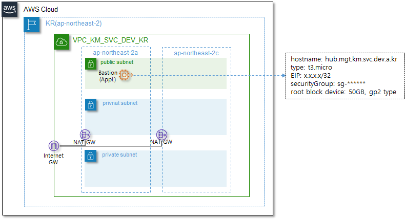

# AWS EC2 Module

AWS에서 EC2 인스턴스를 생성하는 모듈이며, Bastion 서버, Deploy 서버와 같은 일반적인 서버 환경을 생성합니다.


EC2에 대한 자세한 내용은 아래의 AWS 내용을 확인해 보시기 바랍니다.

> ✔ [`EC2`](https://docs.aws.amazon.com/ko_kr/AWSEC2/latest/UserGuide/concepts.html) - Amazon Elastic Compute Cloud(Amazon EC2)는 Amazon Web Services(AWS)클라우드에서 확장 가능 컴퓨팅 용량을 제공합니다. 


## 인프라 사전 준비사항

다음의 인프라가 사전에 설치되어 있어야만, 본 모듈을 사용하여 자원을 생성할 수 있습니다.

|    AWS 인프라    |                          간단 설명                           | Required |     사용 가능 모듈     |
| :--------------: | :----------------------------------------------------------: | :------: | :--------------------: |
|       VPC        | [사용자 정의 가상 네트워크](https://docs.aws.amazon.com/ko_kr/vpc/latest/userguide/what-is-amazon-vpc.html) |  `yes`   |      network/vpc       |
|      Subnet      | [VPC의 IP주소범위](https://docs.aws.amazon.com/ko_kr/vpc/latest/userguide/configure-subnets.html) |  `yes`   |      network/vpc       |
|   Route table    | [네트워크 트래픽 전송규칙](https://docs.aws.amazon.com/ko_kr/vpc/latest/userguide/VPC_Route_Tables.html) |  `yes`   |      network/vpc       |
| Internet Gateway | [인터넷 연결 리소스](https://docs.aws.amazon.com/ko_kr/vpc/latest/userguide/VPC_Internet_Gateway.html) |  `yes`   |      network/vpc       |
|   NAT Gateway    | [Private 서브넷의 인터넷 연결 리소스](https://docs.aws.amazon.com/ko_kr/vpc/latest/userguide/vpc-nat-gateway.html) |   `no`   |      network/vpc       |
|   Network ACL    | [네트워크 방화벽](https://docs.aws.amazon.com/ko_kr/vpc/latest/userguide/vpc-network-acls.html) |   `no`   |      network/vpc       |
|  VPC Endpoints   | [AWS private network을 통한 AWS Service접근](https://docs.aws.amazon.com/ko_kr/vpc/latest/privatelink/vpc-endpoints.html) |   `no`   |   network/endpoints    |
| Security Groups  | [Host 방화벽을 통한 접근제어](https://docs.aws.amazon.com/ko_kr/vpc/latest/userguide/VPC_SecurityGroups.html) |  `yes`   | security/securitygroup |


## 사용예시




위와 같은 구성에서 EC2 instance를 아래와 같은 코드로 생성할 수 있습니다. (※ 아래의 예시 코드에서는 이해를 돕기 위해 변수대신 값을 사용하였으며, 대부분 변수를 사용합니다.)

```yaml
module "ec2" {
    source = "../../../modules/compute/ec2"
    vpc_id = "vpc-******"
    svc_name = "km"
    purpose = "svc"
    env = "dev"
    region_name_alias = "kr"
    instances = {
        bastion = {
            module = "mgmt"
            ami_id = "ami-0ed11f3863410c386" #ubuntu18.04TLS
            type = "t3.micro"
            elastic_ip_address = true
            availability_zone = "ap-northeast-2a"
            subnet_id = "subnet-0f9736f825c3800ba"
            key_name = "kp_ec2_km_mgmt_dev_kr"
            role = "r_ec2-mgmt_dev_kr"
            user_data = templatefile("${path.module}/init_scripts/cloud_init.sh",
                {
                    HOSTNAME = "hub.mgt.km.svc.dev.a.kr"
                    SSHD_PORT = 2022
                    ADMIN_USER = "kmadmin"
                    KUBECONFIG = module.eks.kubeconfig
                 })
            root_block_device = {
                volume_size = "50"
                volume_type = "gp2"
                encrypted = true
                delete_on_termination = true
            }
            security_group_ids = ["sg-******"]
            tags = {
                RES_Class_0 = "OPERATION"
                RES_Class_1 = "BASTION"
                RES_Class_2 = "KR"
            }
        }
    }
}
```
- 모듈의 instances map type 변수에 사용하고자 하는 instance의 spec을 정의한다. key값이 instance명이 된다. instance명등, resource들은 아래의 naming rule을 따라 생성된다. <br>resource naming, tagging시 svc_name, purpose, env, region_name_alias와 같은 variable들이 suffix로 사용된다. (ex, bastion_mgt_km_svc_dev_kr)
  
    > 1. EIP: eip\_natgw\_[service name]\_[purpose]\_[env]\_[region] ex) eip_hub_km_svc_prd_kr
    > 2. EBS: vol\_[ec2]\_[dev]\_[service name]\_[purpose]\_[env]\_[az]\_[region] ex) vol_hub_sda_km_svc_prd_a_kr
    > 3. EC2: [host_name]\_[module]\_[service name]\_[purpose]\_[env]\_[az]\_[region] ex) hub_mgt_km_svc_prd_a_kr
    > 4. AMI: ami\_[dev]\_[ec2 name] ex) ami_sda_bastion_mgt_km_svc_prd_kr
    > 5. Snapshot: snap\_[dev]\_[ec2 name] ex) snap_sda_bastion_mgt_km_svc_prd_kr
    > 6. AutoScaleGroup: asg\_[name]\_[service name]\_[purpose]\_[env]\_[region] ex) asg_web_km_svc_prd_kr
    
- user_data는 cloud_init script를 정의 할 수 있으며, templatefile terraform 함수를 사용하여 template script를 cloud_init script로 rendering하여 사용 할 수 있다.

    > 1) user_data에 사용되는 cloud-init script는 사용자가 환경에 맞도록 별도로 생성하는 파일이며, 여기에서 사용된 script는 변수로 HOSTNAME, SSHD_PORT, 신규 생성할 administrator 계정 ADMIN_USER, 계정별 생성할 kubeconfig파일인 KUBECONFIG를 설정한다.
    > 2)  또한, 기본 security rule을 적용 할 수 있다.
    > 3)  기본 제공되는 script를 참고하여, 각 환경에 맞는 script를 생성할 수 있습니다.

- root_block_device, ebs_block_device 항목은 ec2인스턴스에 추가할 HDD 라고 보면 되며, 세부적인 설정 값은 아래의 Inputs를 참고한다.

    

## Requirements

| Name      | Version |
| :-------- | :------ |
| terraform | >= 0.12 |


## Providers

| Name | Version |
| :--- | :------ |
| aws  | >~ 4.0  |


## Resources

| Name                                                         | Type     |
| :----------------------------------------------------------- | :------- |
| [aws_eip](https://registry.terraform.io/providers/hashicorp/aws/latest/docs/resources/eip) | resource |
| [aws_instance](https://registry.terraform.io/providers/hashicorp/aws/3.21.0/docs/resources/instance) | resource |
| [aws_ec2_serial_console_access](https://registry.terraform.io/providers/hashicorp/aws/3.21.0/docs/resources/ec2_serial_console_access) | resource |


## Inputs

| Name                                                  | Description                                                  |      Type      | Default | Required |
| :---------------------------------------------------- | :----------------------------------------------------------- | :------------: | :-----: | :------: |
| vpc_id                                                | EC2 인스턴스를 생성할 VPC ID                                  |    `string`    |         |  `yes`   |
| svc_name                                              | VPC의 사용 용도                                              |    `string`    |         |  `yes`   |
| purpose                                               | VPC의 용도를 나타낼 수 있는 서비스 명 (ex, svc / mgt)         |    `string`    |         |  `yes`   |
| env                                                   | 시스템 구성 환경 (ex, dev / stg / prd)                       |    `string`    |         |  `yes`   |
| region_name_alias                                     | 서비스 AWS Region alias (ex, ap-northeast-2 → kr)            |    `string`    |         |  `yes`   |
| **instances**                                         | 생성할 ec2 instance 에 대한 세부 정보                        |     `any`      |         |  `yes`   |
| **instances**.module                                  | ec2인스턴스의 업무상 역할 그룹 (ex, mgmt)                    |    `string`    |         |  `yes`   |
| **instances**.count                                   | 생성할 인스턴스 갯수 정의                                    |    `number`    |   `1`   |   `no`   |
| **instances**.ami-id                                  | ec2 인스턴스 생성할 때 사용할 AMI의 ID                       |    `string`    |         |   yes    |
| **instances**.type                                    | ec2 instance type [[aws instance type]](https://aws.amazon.com/ko/ec2/instance-types/?trkCampaign=acq_paid_search_brand&sc_channel=PS&sc_campaign=acquisition_KR&sc_publisher=Google&sc_category=Cloud%20Computing&sc_country=KR&sc_geo=APAC&sc_outcome=acq&sc_detail=aws%20ec2%20instance%20types&sc_content={ad%20group}&sc_matchtype=e&sc_segment=536451469373&sc_medium=ACQ-P\|PS-GO\|Brand\|Desktop\|SU\|Cloud%20Computing\|EC2\|KR\|EN\|Sitelink&s_kwcid=AL!4422!3!536451469373!e!!g!!aws%20ec2%20instance%20types&ef_id=CjwKCAiAxJSPBhAoEiwAeO_fP5_zYUQ2QdS-fwqGAva6tXuSOhbNlOyziQMoBr-g_aUJMm6PhL-OThoC3doQAvD_BwE:G:s&s_kwcid=AL!4422!3!536451469373!e!!g!!aws%20ec2%20instance%20types) |    `string`    |         |   yes    |
| **instances**.elastic_ip_address                      | ec2 instance에 EIP attach 여부                               |     `bool`     |         |  `yes`   |
| **instances**.associate_public_ip_address             | ec2 instance에 public ip attatch 여부                        |     `bool`     | `true`  |   `no`   |
| **instances**.availability_zone                       | instance를 설치할 availability zone (ex, ap-northeast-2a)    |    `string`    |         |  `yes`   |
| **instances**.subnet_id                               | instance가 위치할 subnet id                                  |    `string`    |         |  `yes`   |
| **instances**.private_ip                              | instance에 설정할 private ip 주소                            |    `string`    | `null`  |   `no`   |
| **instances**.key_name                                | 인스턴스에 접속할 때 사용할 ssh key                          |    `string`    |         |  `yes`   |
| **instances**.role                                    | 인스턴스에 할당할 instance role arn                          |    `string`    | `null`  |   `no`   |
| **instances**.user_data                               | cloud_init.sh 로 인스턴스가 생성될 때 실행할 초기화 script   |    `string`    | `null`  |   `no`   |
| **instances**.detailed_monitoring                     | detailed cloudwatch monitoring (1분주기)사용여부             |     `bool`     | `false` |   `no`   |
| **instances**.security_group_ids                      | 인스턴스에 사용할 security group ID 리스트                   | `list(string)` |         |  `yes`   |
| **instances**.tags                                    | 인스턴스에 사용할 tag 정의                                   | `map(string)`  | `null`  |   `no`   |
| **instances**.root_block_device                       | 인스턴스의 root block device(HDD) 설정                       |    `object`    |         |  `yes`   |
| **instances**.root_block_device.volume_size           | root 디스크 크기 (ex, 50GB)                                  |    `string`    |         |  `yes`   |
| **instances**.root_block_device.volume_type           | root 디스크 종류 (ex, gp2 / gp3 등)                          |    `string`    |         |  `yes`   |
| **instances**.root_block_device.encrypted             | root 디스크 내용에 대한 encrypt 옵션                         |     `bool`     | `true`  |   `no`   |
| **instances**.root_block_device.delete_on_termination | 인스턴스 termination시 root디스크 같이 삭제여부              |     `bool`     | `true`  |   `no`   |
| **instances**.root_block_device.tags                  | root EBS 볼륨에 사용할 tag 정의                              | `map(string)`  | `null`  |   `no`   |
| **instances**.ebs_block_device                        | 인스턴스의 EBS block device(HDD) 설정                        | `list(object)` |   []    |   `no`   |
| **instances**.ebs_block_device.volume_size            | EBS 디스크 크기 (ex, 50GB)                                   |    `string`    |         |  `yes`   |
| **instances**.ebs_block_device.volume_type            | EBS 디스크 종류 (ex, gp2 / gp3 등)                           |    `string`    |         |  `yes`   |
| **instances**.ebs_block_device.encrypted              | EBS 디스크 내용에 대한 encrypt 옵션                          |     `bool`     | `true`  |   `no`   |
| **instances**.ebs_block_device.delete_on_termination  | 인스턴스 termination시 EBS디스크 같이 삭제여부               |     `bool`     | `true`  |   `no`   |
| **instances**.ebs_block_device.tags                   | EBS EBS 볼륨에 사용할 tag 정의                               | `map(string)`  | `null`  |   `no`   |
| enable_serial_console_access                          | Serial Console Access 가능 여부 설정                         |     `bool`     | `false` |   `no`   |

### 참고

------

**`instances`** - instances input variable은 아래와 같은 구조로 구성되어 있다. (실제 variable type은 any이나 아래와 같은 형식으로 사용되고 있음을 참고)

```yaml
type = map(object({
    module = string #(Required)
    count = number #(Optional)
    ami_id = string #(Required)
    type = string #(Required)
    elastic_ip_address = bool #(Required)
    associate_public_ip_address = bool #(Optional) default: false
    availability_zone = string #(Required)
    subnet_id = string #(Required)
    private_ip = string #(Optional) default: null
    key_name = string #(Required)
    role = string #(Optional) default: null
    user_data = string #(Optional) default: null
    detailed_monitoring = bool #(Optional) default: false
    root_block_device = object({ #(Required)
        volume_size = string #(Required)
        volume_type = string #(Required)
        encrypted = bool #(Optional) default: false
        delete_on_termination = bool #(Optional) default: true
    })
    ebs_block_device = list(object({ #(Optional) default: []
        device_name = string #(Required)
        volume_size = string #(Required)
        volume_type = string #(Required)
        encrypted = bool #(Optional) default: false
        delete_on_termination = bool #(Optional) default: true
    }))
    security_group_ids = list(string) #(Required)
    tags = map(string) #(Optional) default: {}
}))
```


## Outputs

| Name        | Description                                                  |
| :---------- | :----------------------------------------------------------- |
| ec2_eip_map | ec2 이름과 EIP map  (ex, {"bastion": "10.0.0.1/32", "deploy": "10.0.0.2/32"} ) |
| ec2_id_map  | ec2 이름과 인스턴스 ID map (ex, {"bastion": "i-034c81913d79fa3a1", "deploy": "i-06a655525b173fae9"}) |
| enable_serial_console_access  | Serial Console Access 가능여부 확인 |