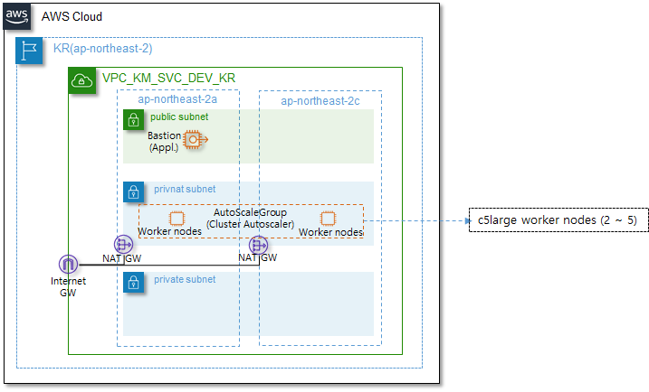
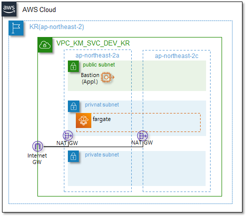

# AWS EKS Module

AWS에서 EKS(Elastic Kubernetes Service)를 생성하기 위한 모듈입니다.


EKS에 대한 자세한 내용은 아래의 AWS 내용을 확인해 보시기 바랍니다.

> ✔ [EKS](https://docs.aws.amazon.com/ko_kr/eks/latest/userguide/what-is-eks.html) - Amazon Elastic Kubernetes Service(Amazon **EKS**)는 Kubernetes를 실행하는 데 사용할 수 있는 관리형 서비스입니다. 
> AWS Kubernetes 제어 플레인 또는 노드를 설치, 작동 및 유지 관리할 필요가 없습니다.


## 인프라 사전 준비사항

다음의 인프라가 사전에 설치되어 있어야만, 본 모듈을 사용하여 자원을 생성할 수 있습니다.

|          AWS 인프라          |                          간단 설명                           | Required |     사용 가능 모듈     |
| :--------------------------: | :----------------------------------------------------------: | :------: | :--------------------: |
|             VPC              | [사용자 정의 가상 네트워크](https://docs.aws.amazon.com/ko_kr/vpc/latest/userguide/what-is-amazon-vpc.html) |  `yes`   |      network/vpc       |
|            Subnet            | [VPC의 IP주소범위](https://docs.aws.amazon.com/ko_kr/vpc/latest/userguide/configure-subnets.html) |  `yes`   |      network/vpc       |
|         Route table          | [네트워크 트래픽 전송규칙](https://docs.aws.amazon.com/ko_kr/vpc/latest/userguide/VPC_Route_Tables.html) |  `yes`   |      network/vpc       |
|       Internet Gateway       | [인터넷 연결 리소스](https://docs.aws.amazon.com/ko_kr/vpc/latest/userguide/VPC_Internet_Gateway.html) |  `yes`   |      network/vpc       |
|         NAT Gateway          | [Private 서브넷의 인터넷 연결 리소스](https://docs.aws.amazon.com/ko_kr/vpc/latest/userguide/vpc-nat-gateway.html) |   `no`   |      network/vpc       |
|         Network ACL          | [네트워크 방화벽](https://docs.aws.amazon.com/ko_kr/vpc/latest/userguide/vpc-network-acls.html) |   `no`   |      network/vpc       |
|        VPC Endpoints         | [AWS private network을 통한 AWS Service접근](https://docs.aws.amazon.com/ko_kr/vpc/latest/privatelink/vpc-endpoints.html) |   `no`   |   network/endpoints    |
| EC2 인스턴스(Bastion 호스트) | [EC2 인스턴스](https://docs.aws.amazon.com/ko_kr/AWSEC2/latest/UserGuide/concepts.html) |  `yes`   |      compute/ec2       |
|      IAM Role & Policy       | [접근권한 및 계정관리](https://docs.aws.amazon.com/ko_kr/IAM/latest/UserGuide/id.html) |  `yes`   |       users/iam        |
|       Security Groups        | [Host 방화벽을 통한 접근제어](https://docs.aws.amazon.com/ko_kr/vpc/latest/userguide/VPC_SecurityGroups.html) |  `yes`   | security/securitygroup |

또한 EKS 모듈은 내부적으로 cluster설정을 위한 script가 구동되는데, 배포 환경에 반드시 curl 및 jq가 설치되어 있어야 정상 동작합니다.


## 사용예시 - Worker node로 EC2 managed node group을 사용




위와 같은 구성에서 EKS Cluster를 아래와 같은 코드로 생성할 수 있습니다. (※ 아래의 예시 코드에서는 이해를 돕기 위해 변수대신 값을 사용하였으며, 대부분 변수를 사용합니다.)

```yaml
module "eks" {
    source = "../../../modules/compute/eks"
    vpc_id = "vpc-******"
    svc_name = "km"
    purpose = "svc"
    env = "dev"
    region_name_alias = "kr"
    
    ## cluster configuration
    cluster_name = "mgmt"
    cluster_version = "1.22"
    cluster_role_arn = arn:aws:iam::******:role/r_eks_dev_kr
    ingress_subnet_ids = ["subnet-******", "subnet-******"] # Ingress가 사용할 subnets(AWS LB가 생성될 network subnet)
    nodegrp_subnet_ids = ["subnet-******", "subnet-******"] # Worker nodes가 위치할 subnets
    nodegrp_role_arn = arn:aws:iam::******:role/r_eksnode_dev_kr
    enabled_cluster_log_types = ["api"]
    security_group_ids = ["sg-******"]
    eks_cluster_admin_users = ["admin.user@email.com"] # EKS cluster admin 계정 cm/aws-auth.yaml에 mapUsers에 자동 설정됨
    eks_cluster_admin_roles = ["arn:aws:iam::******:role/r_eks-admin-role_dev_kr"] # EKS cluster admin role cm/aws-auth.yaml에 mapRoles에 자동 설정됨
    eks_cluster_readonly_users = ["readonly.user@email.com"] # EKS cluster read-only 사용자 설정
    ## worker nodes configuration
    eks_node_groups = {
        mgmt = {	# nodegrp_mgmt_km_svc_dev_kr tagging으로 node group 생성
            ami_type = "AL2_x86_64"
            capacity_type = "ON_DEMAND"
            instance_types = ["c5.large"]
            scaling_config = { max_size = 5, min_size = 2, desired_size = 2 }
            update_config = { max_unavailable_percentage = 25 }
            key_name = aws_key_pair.ec2_ssh.key_name
            vpc_security_group_ids = ["sg-******", "sg-******"]
            tag_specifications = {
                instance = { Name: "worker_eks_km_svc_dev_kr" }
                volume = { Name: "vol_worker_eks_sda_km_svc_dev_kr" }
                network-interface = { Name: "eth_worker_eks_km_svc_dev_kr" }
            }
        }
    }
}
```

- cluster명 등, resource들은 아래의 naming rule을 따라 생성된다. <br>resource naming, tagging시 svc_name, purpose, env, region_name_alias와 같은 variable들이 suffix로 사용된다. (ex, eks_mgmt_km_svc_dev_kr)

  > 1. EKS-cluster: eks_\[cluster_name]\_[service_name]\_[purpose]\_[env]\_[region] ex) eks_mgmt_km_svc_dev_kr
  > 2. EKS-node: nodegrp\_[nodegroup_name]_[service_name]\_[purpose]\_[env]\_[region] ex) nodegrp_mgmt_km_svc_dev_kr

- cluster_role은 EKS Cluster가 사용하는 role로써 AmazonEKSClusterPolicy, AmazonEKSVPCResourceController policy를 반드시 포함해야 하며, nodegroup_role의 경우, worker node에 적용되는 role로써, AmazonEKSWorkerNodePolicy, AmazonEKS_CNI_Policy, AmazonEC2ContainerRegistryReadOnly 를 반드시 포함해야 한다.

- EKS cluster는 cluster security group을 자동으로 생성하기 때문에 terraform에서는 자동 생성된 cluster security group을 관리할 수가 없다. 자동 생성된 cluster security group은 outbound anyopen이 설정되어 있으므로, 보안정책상 outbound anyopen policy를 삭제 할 필요가 있다. 이를 위해서 EKS module내부에서 aws cli 를 사용(provider local-exec)하여 security group을 내부적으로 수정한다.

  ```yaml
  provisioner "local-exec" {
      command = "${path.module}/cluster_security_group.sh $CLUSTER_ID $TAG"
      environment = {
          CLUSTER_ID = "${aws_eks_cluster.eks_cluster.vpc_config[0].cluster_security_group_id}"
          TAG = "sk_${var.cluster_name}_${local.suffix}"
      }
  }
  ```

- eks_cluster_admin_users를 설정하여, EKS cluster에 접근 가능한 IAM 계정을 설정한다. 이 항목에 설정된 사용자의 경우, system:master의 k8s cluster권한을 보유하게 된다. (관리 서버에서 aws configure 후 해당 IAM계정을 통해 kubectl을 사용, cluster를 관리할 수 있다.)

- eks_cluster_admin_roles을 설정하여, EKS cluster에 접근 가능한 IAM role을 설정한다. 

  이렇게 IAM role에 admin권한을 할당하면, argocd pod의 service account(IRSA)에 해당 role을 할당하여, argocd가 다른 여러 cluster를 제어 할 수 있다.

- eks_cluster_readonly_users를 설정하여 cluster에 read-only로 접근 가능한 IAM계정을 설정한다.

- eks node group을 생성할 때,  Launch configuration를 사용하여 생성하는 방식을 사용하는데, 이는 node group의 worker node에 terraform에서 생성한 security group을 원활하게 할당하기 위함이다.

- node group의 scaleing_config.max_size를 적당하게 설정하여, 향후 cluster auto-scaling시 원활하게 worker node가 늘어날 수 있도록 한다.

- node group은 map(object)의 형태로, 이름과 값을 지정하여 한번 설정으로 여러개의 node group를 생성할 수 있다.

- nodegrp_subnet_ids는 반드시 2개 이상의 다른 availability zone에 할당된 subnet id list를 입력하여야 한다.


## 사용예시 - Worker node로 fargate를 사용




위와 같은 구성에서 EKS Cluster를 아래와 같은 코드로 생성할 수 있습니다. (※ 아래의 예시 코드에서는 이해를 돕기 위해 변수대신 값을 사용하였으며, 대부분 변수를 사용합니다.)

```yaml
module "iam" {
    source = "../../../modules/identity/iam"
    env = "dev"
    region_name_alias = "kr"
    create_default_policies = false
    use_default_password_policy = false
    roles = {
        eksfargate = {
            type = "Service"
            identifiers = ["eks-fargate-pods.amazonaws.com"]
            policies = ["AmazonEKSFargatePodExecutionRolePolicy"]
        }
    }
}

module "eks" {
    source = "../../../modules/compute/eks"
    vpc_id = "vpc-******"
    svc_name = "km"
    purpose = "svc"
    env = "dev"
    region_name_alias = "kr"
    
    ## cluster configuration
    cluster_name = "mgmt"
    cluster_version = "1.22"
    cluster_role_arn = arn:aws:iam::******:role/r_eks_dev_kr
    ingress_subnet_ids = ["subnet-******", "subnet-******"] # Ingress가 사용할 subnets(AWS LB가 생성될 network subnet)
    nodegrp_subnet_ids = ["subnet-******", "subnet-******"] # Worker nodes가 위치할 subnets
    nodegrp_role_arn = arn:aws:iam::******:role/r_eksnode_dev_kr
    enabled_cluster_log_types = ["api"]
    security_group_ids = ["sg-******"]
    eks_cluster_admin_users = ["admin.user@email.com"] # EKS cluster admin 계정 cm/aws-auth.yaml에 mapUsers에 자동 설정됨
    eks_cluster_admin_roles = ["arn:aws:iam::******:role/r_eks-admin-role_dev_kr"] # EKS cluster admin role cm/aws-auth.yaml에 mapRoles에 자동 설정됨
    eks_cluster_readonly_users = ["readonly.user@email.com"] # EKS cluster read-only 사용자 설정
    ## worker nodes configuration
    eks_fargate_profiles = {
        "dev" = {
            role_arn = module.iam.role_arn_map["eksfargate"]
            subnet_ids = ["subnet-******", "subnet-******"]
            selectors = [ #특정 namespace, labels만 pod 생성
                          { namespace = "test",  labels = {"app" = "test", "app2" = "test2"}}
                        ]
            security_group_ids = ["sg-******"]
        }
    }
}
```

- fargate를 사용하기 위해서는 fargate에서 pods를 실행 시킬 수 있는 IAM role(AmazonEKSFargatePodExecutionRolePolicy)을 미리 생성해야 한다.

- selectors를 사용하여, 특정 namespace 또는 label을 가진 resource만 fargate로 구동 할 수 있다.


## EKS 업그레이드 방법

1. Master node upgrade (control plane)

   * master node는 terraform code에서 eks의 version을 변경 한 후 plan, apply를 실행하면 됩니다.

   * EKS addon (vpc-cni, kubeproxy, coredns, efs/ebs_cni)의 경우, 자동으로 update되지 않았다면, eks module의 addon설정을 통해 업그레이드를 해야합니다. 자동으로 upgrade되지 않아서, 아래의 버전으로 add_ons를 설정해 줘야 합니다. (버전 호환성은 [매뉴얼](https://docs.aws.amazon.com/ko_kr/eks/latest/userguide/pod-networking.html)을 참고하시기 바랍니다)

     * EX) eks.1.22 => eks1.23 로 업그레이드 하는 경우, Addon의 버전 호환성은 다음과 같습니다.<br>coredns: coredns:v1.8.7-eksbuild.1 => 1.8.7-eksbuild.2 (default) <br>vpc-cni: amazon-k8s-cni:v1.10.1-eksbuild.1 => 1.11.4-eksbuild.1 <br>kube-proxy: kube-proxy:v1.22.6-eksbuild.1 => v1.23.8-eksbuild.2 <br>
       aws-ebs-csi-driver: (신규)  aws-ebs-csi-driver:v1.11.4-eksbuild.1

     * terraform에서는 아래와 같이 add_ons parameter를 입력하면 됩니다.

       ```yaml
       module "eks_dev" {
        ...
        add_ons = [
               { name = "vpc-cni", version = "v1.11.4-eksbuild.1" },
               { name = "kube-proxy", version = "v1.23.8-eksbuild.2" },
               { name = "coredns", version = "v1.8.7-eksbuild.2" },
               { name = "aws-ebs-csi-driver", version = "v1.11.4-eksbuild.1" }
           ]
           ...
       }
       ```

2. worker node upgrade

   master node upgrade이후 worker node를 업그레이드 하는 방법은 아래의 2가지 방법이 있습니다.

   * terraform에서 업그레이드: terraform replace 명령을 통해서 수행할 수 있습니다. (terraform replace [worker node state file] => terraform apply) 단, terraform code에서 aws_eks_node_group resource가 lifecycle create_before_destroy=true이어야 한다. 하지만 <font color=red>이 방법은 정상적인 rollover 형식의 upgrade를 지원하지 못합니다.</font>
   * AWS Console 에서 terraform console에서 업그레이드: Console에서 upgrade를 수행해도 기존 terraform code에 영향을 미치지 않으므로, 정상적이고 빠른 rolling update를 위해서 AWS Console에서 업그레이드 하는것을 추천합니다.<br>AWS에서 이론상으로는 새로운 worker node들을 생성한 후, 설정된 rollover percentage(기본 25%)에 따라서 기존 node에 noschedule taint시키고 모든 pods를 이관한 후 기존 node를 삭제하게 됩니다. 주의할 사항은 만일 특정 서비스의 pods가 특정 노드에 집중되어 있어 rollover 대상에 모든 pods가 포함된다면, 서비스의 중단이 발생할 수 있으므로 주의가 필요합니다. (세심한 pods배치계획이 필요하며 - 가장 확실한 방법은 여러개의 worker node group으로 분산하는 방법입니다.)

   helm chart, 또는 k8s manifest의 apiVersion이 변경되었는지, deprecated된 apiVersion이 있는지 확인하여 모든 source를 변경해야만 합니다. 필요 시, helm chart upgrade가 필요 할 수도 있습니다.

3. 각종 client 업그레이드
   . kubectl, eksctl 등 EKS 관련 client 업그레이드를 수행합니다.

AWS에서는 1년(약 5개의 upgrade분의 master-node, worker-node의 version의 하위 호환성을 지원한다고 하지만, 업그레이드 계획이 복잡해지므로 가급적 빨리 하는게 좋습니다.)


## Requirements

| Name      | Version |
| :-------- | :-----: |
| terraform | >= 0.12 |


## Providers

| Name  | Version |
| :---- | :-----: |
| aws   | >~ 4.0  |
| local | > 2.2.2 |


## Resources

| Name                                                         |   Type   |
| :----------------------------------------------------------- | :------: |
| [aws_caller_identity](https://registry.terraform.io/providers/hashicorp/aws/latest/docs/data-sources/caller_identity) |   data   |
| [aws_eks_cluster_auth](https://registry.terraform.io/providers/hashicorp/aws/latest/docs/data-sources/eks_cluster_auth) |   data   |
| [tls_certificate](https://registry.terraform.io/providers/hashicorp/tls/latest/docs/data-sources/certificate) |   data   |
| [aws_cloudwatch_log_group](https://registry.terraform.io/providers/hashicorp/aws/latest/docs/resources/cloudwatch_log_group) | resource |
| [aws_launch_template](https://registry.terraform.io/providers/hashicorp/aws/latest/docs/resources/launch_template) | resource |
| [aws_eks_cluster](https://registry.terraform.io/providers/hashicorp/aws/latest/docs/resources/eks_cluster) | resource |
| [aws_eks_node_group](https://registry.terraform.io/providers/hashicorp/aws/latest/docs/resources/eks_node_group) | resource |
| [aws_iam_openid_connect_provider](https://registry.terraform.io/providers/hashicorp/aws/latest/docs/resources/iam_openid_connect_provider) | resource |
| [aws_ec2_tag](https://registry.terraform.io/providers/hashicorp/aws/latest/docs/resources/ec2-tag) | resource |
| [aws_autoscaling_group_tag](https://registry.terraform.io/providers/hashicorp/aws/latest/docs/resources/autoscaling_group_tag) | resource |
| [aws_eks_fargate_profile](https://registry.terraform.io/providers/hashicorp/aws/latest/docs/resources/eks_fargate_profile) | resource |


## Inputs

| Name                                                         | Description                                                  |                  Type                   |    Default    | Required |
| :----------------------------------------------------------- | :----------------------------------------------------------- | :-------------------------------------: | :-----------: | :------: |
| vpc_id                                                       | EC2 인스턴스를 생성할 VPC ID                                 |                `string`                 |               |  `yes`   |
| svc_name                                                     | VPC의 사용 용도      |                `string`                 |               |  `yes`   |
| purpose                                                      | VPC의 용도를 나타낼 수 있는 서비스 명 (ex, svc / mgmt)       |                `string`                 |               |  `yes`   |
| env                                                          | 시스템 구성 환경 (ex, dev / stg / prd)                      |                `string`                 |               |  `yes`   |
| region_name_alias                                            | 서비스 AWS Region alias (ex, ap-northeast-2 → kr)            |                `string`                 |               |  `yes`   |
| cluster_name                                                 | EKS cluster 이름                                             |                `string`                 |  |  `yes`   |
| cluster_version                                              | EKS cluster version                     | `string`     | `latest` |   `no` |
| cluster_role_arn                                             | EKS cluster의 Role arn                                       |                `string`                 |               |  `yes`   |
| service_ipv4_cidr                                            | EKS cluster가 사용할 내부 cluster network ip cidr            |                `string`                 | 자동할당 |   `no`   |
| ingress_subnet_ids                                           | EKS cluster에서 사용할 Ingress controller의 subnet IDs (보통 public subnet을 사용한다.) |             `list(string)`              |           |  `yes`   |
| security_group_ids                                           | EKS에 설정할 additional security group IDs<br/>자동 생성되는 cluster security group이외의 추가적인 security groups |             `list(string)`              |     `[]`     |   `no`   |
| enabled_cluster_log_types                                    | EKS에서 생성하는 logs중 저장할 log type을 설정<br/>api, audit, authenticator, controllerManager, scheduler <br/> 로그는 cloudwatch log group에 생성하여 저장한다 |             `list(string)`              |     `[]`      |   `no`   |
| log_retention_in_days                                        | enabled_cluster_log_types을 저장하는 cloudwatch log group의 retention period |                `number`                 |     `365`     |   `no`   |
| log_kms_key_id                                               | 저장할 로그 데이터를 암호화하기 위한 KMS key ID              |                `string`                 |    `null`     |   `no`   |
| endpoint_private_access                                      | EKS를 private하게 사용할지 여부                              |                 `bool`                  |    `true`     |  `no`  |
| endpoint_public_access                                       | EKS를 public하게 사용할지 여부                               |                 `bool`                  |    `false`    |  `no`  |
| public_access_cidrs                                          | public하게 사용할 EKS에 접근 가능한 network CIDR을 정의      |             `list(string)`              |     `[]`      |   `no`   |
| encryption_provider_key_arn                                  | eks resource를 encrypt할 KMS Customer key ARN                |                `string`                 | `null` |   `no`   |
| encryption_resources                                         | encrypt할 eks resource를 정의                                |             `list(string)`              |     `[]`      |   `no`   |
| eks_cluster_admin_users                                      | EKS admin(system:masters)를 사용할 사용자 IAM 계정정보       |             `list(string)`              |     `[]`      |   `no`   |
| eks_cluster_readonly_users | EKS readonly(system:viewers)를 사용할 사용자 IAM 계정정보 | `list(string)` | `[]` | `no` |
| eks_cluster_rbac_users | EKS RBAC 사용자 설정 (그룹별 사용자 및 rbac policy 정의) | `any` | `[]` | `no` |
| eks_cluster_admin_roles | EKS admin(system:masters)를 사용할 Role IAM 계정정보 | `list(string)` | `[]` | `no` |
| eks_cluster_readonly_roles | EKS readonly(system:viewers)를 사용할 사용자 IAM Role정보 | `list(string)` | `[]` | `no` |
| eks_cluster_rbac_roles | EKS RBAC Role 설정 (그룹별 사용자 및 rbac policy 정의) | `any` | `[]` | `no` |
| nodegrp_subnet_ids                                           | worker node들이 설치될 subnet IDs                            |             `list(string)`              |               |  `yes`   |
| nodegrp_role_arn                                             | node group(worker nodes)에 할당할 instance role arn          |                `string`                 |               |  `yes`   |
| use_container_insights | Container insight 사용여부 | `bool` | `true` | `no` |
| container_insights_log_groups | Container insight에서 저장하는 cloudwatch log groups | `list(string)` | `[alication", "dataplane", "host", "performance]` | `no` |
| container_insights_additional_log_groups | Container insight에서 저장하는 추가적인 cloudwatch log groups (ex, prometheus) | `list(string)` | `[]` | `no` |
| **eks_node_groups**         | EKS node group을 정의하기 위한 정보 블럭                  |                  `any`                  |               |  `yes`   |
| **eks_node_groups**.ami_type                                 | Amazon AMI Type (AL2_x86_64, AL2_x86_64_GPU, AL2_ARM_64, CUSTOM, BOTTLEROCKET_ARM_64, BOTTLEROCKET_x86_64) |                `string`                 | `AL2_x86_64`  |  `no`  |
| **eks_node_groups**.capacity_type             | EKS managed node group의 capacity type (ON_DEMAND, SPOT)     |                `string`                 |  `ON_DEMAND`  |  `no`  |
| **eks_node_groups**.instance_types            | worker nodes의 인스턴스 타입                                 |             `list(string)`              | `[c5.xlarge]` |  `no`  |
| **eks_node_groups**.cri_type | Container Runtime Interface 설정 (`dockerd`, `containerd`) 만일 아무런 설정을 하지 않으면 EKS worker node AMI default 값을 따른다. (현재, 1.23까지는 dockerd가 default이고, 1.24부터 dockerd deprecated 되므로 containerd가 default로 지원) | `string` | `null` | `no` |
| **eks_node_groups**.force_update_version      | Pods가 drain될 수 없는 상황에도 강제로 업데이트 할지 결정    |                 `bool`                  |    `false`    |   `no`   |
| **eks_node_groups**.labels                    | k8s labels 설정 (key, value pair)                            |              `map(string)`              | `{}` |   `no`   |
| **eks_node_groups**.disable_api_termination   | 만일 true라면, EC2 인스턴스가 장제 삭제되는 것을 방지        |                 `bool`                  |    `false`    |   `no`   |
| **eks_node_groups**.key_name                  | worker node에 접속할 때 사용할 SSH key pair                  |                `string`                 | `null` |   `no`   |
| **eks_node_groups**.monitoring                | worker node detailed monitoring (1분 주기)                   |                 `bool`                  |    `false`    |   `no`   |
| **eks_node_groups**.vpc_security_group_ids    | launch template에 사용할 vpc security group이며, 이 security group이 모든 worker nodes에 자동 설정된다. |             `list(string)`              |     `[]`      |   `no`   |
| **eks_node_groups**.tag_specifications        | worker node에 설정할 tags                                    |              `map(string)`              |      {}       |   `no`   |
| **eks_node_groups**.scaling_config            | node group의 auto scaling 관련 설정                          |                  `any`                  |               |  `yes`   |
| **eks_node_groups**.scaling_config.desired_size | desired size of worker nodes                                 |                `number`                 |               |  `yes`   |
| **eks_node_groups**.scaling_config.max_size   | max size of worker nodes                                     |                `number`                 |               |  `yes`   |
| **eks_node_groups**.scaling_config.min_size   | min size of worker nodes                                     |                `number`                 |               |  `yes`   |
| **eks_node_groups**.update_config.max_unavailable | EKS node group 업그레이드시 몇대씩 죽여가면서 rolling 업그레이드 할 것인지 정의 |                `number`                 |      `1`      |  `no`  |
| **eks_node_groups**.update_config.max_unavailable_percentage | EKS node group 업그레이드시 몇%씩 죽여가면서 rolling 업그레이드 할 것인지 정의 |                `number`                 |     `25`      |  `no`  |
| **eks_node_groups**.taint                     | worker node에 설정할 k8s taint 설정 값                       |                  `any`                  | `null` |  `no`  |
| **eks_node_groups**.taint.key                 | worker node에 설정할 k8s taint key                           |                `string`                 |               |   `yes`   |
| **eks_node_groups**.taint.value               | worker node에 설정할 k8s taint value                         |                `string`                 |               |   `yes`   |
| **eks_node_groups**.taint.effect              | worker node에 설정할 k8s taint effect                        |                `string`                 |               |   `yes`   |
| **eks_node_groups**.block_device_mappings     | worker node에 할당할 EBS (Block device) 정보                 |                  `any`                  |    `null`     |   `no`   |
| **eks_node_groups**.block_device_mappings.device_name | block device name (ex, /dev/xvda)                            |                `string`                 |  `/dev/xvda`  |  `no`  |
| **eks_node_groups**.block_device_mappings.volume_type | block device volume type                                     |                `string`                 |     `gp2`     |  `no`  |
| **eks_node_groups**.block_device_mappings.volume_size | block device volume size (20GB까지 무료)                     |                `number`                 |     `20`      |  `no`  |
| **eks_node_groups**.block_device_mappings.iops | provisioned EBS를 사용하는 경우, volume의 iops               |                `number`                 | `null` |   `no`   |
| **eks_node_groups**.block_device_mappings.throughput | provisioned EBS를 사용하는 경우, volume의 throughtput        |                `number`                 | `null` |   `no`   |
| **eks_node_groups**.block_device_mappings.encrypted | EBS 볼륨 암호화 여부 결정                                    |                 `bool`                  |    `true`    |   `no`   |
| **eks_node_groups**.block_device_mappings.kms_key_id | worker node의 데이터 encryption을 위한 KMS Key ID            |                `string`                 | `null` |   `no`   |
| **eks_node_groups**.block_device_mappings.snapshot_id | worker node의 EBS 생성할 때 사용할 snapshot ID               |                `string`                 | `null` |   `no`   |
| **eks_node_groups**.block_device_mappings.delete_on_termination | worker node가 삭제될 때 EBS도 자동 삭제할지 여부             |                 `bool`                  |    `true`     |   `no`   |
| **eks_node_groups**.network_interfaces        | woker node에 생성할 additional eif 설정                      |                  `any`                  | `null` | `no` |
| **eks_node_groups**.network_interfaces.associate_public_ip_address | EIF에 public address를 assign할지 여부                       |                 `bool`                  |    `false`    |   `no`   |
| **eks_node_groups**.network_interfaces.private_ip_address | EIF에 할당할 private ip address                              |                `string`                 |  |   `yes`   |
| **eks_node_groups**.network_interfaces.delete_on_termination | Worker node가 삭제될 때 EIF도 같이 삭제여부                  |                 `bool`                  |    `true`     |   `no`   |
| **eks_fargate_profiles** | EC2 대신 fargate를 사용하여 pods를 구성할 때 사용 | `any` | `{}` | `no` |
| **eks_fargate_profiles**.role_arn | AmazonEKSFargatePodExecutionRolePolicy 를 가진 eks fargate role | `string` |  | `yes` |
| **eks_fargate_profiles**.selectors | fargate에서 실행할 k8s resource의 namespaace, labels 정의 | `list(object)` |  | `yes` |
| **eks_fargate_profiles**.selectors.namespace | k8s resouce의 namespace 정의 | `string` |  | `yes` |
| **eks_fargate_profiles**.selectors.labels | k8s resouce의 labels 정의 | `map(string)` | `{}` | `no` |
| **eks_fargate_profiles**.subnet_ids                          | fargate가 수행될 private subnet IDs | `list(string)` |  | `yes` |
| **eks_fargate_profiles**.security_group_ids | subnet에 생성된 private한 fargate interface(ENI)에 설정될 security group IDs | `list(string)` |  | `yes` |
| **eks_fargate_profiles**.fargate_only | EC2 node group을 사용하지 않고, fargate only로 사용하는 경우 | `bool` | `false` | `no` |
| **eks_fargate_profiles**.tags | Key-value map of resource tags | `map(string)` | `{}` | `no` |
| **add_ons** | EKS add on 설정 (vpc-cni, kube-proxy 등) | `any` | `[]` | `no` |
| **add_ons**.name | add_on 이름 (ex, `vpc-cni`) ([설정참고](https://docs.aws.amazon.com/cli/latest/reference/eks/list-addons.html)) | `string` |  | `yes` |
| **add_ons**.version | add_on 버전 (ex, `v1.10.1-eksbuild.1`) | `string` | `null` | `no` |
| **add_ons**.resolve_conflicts | 동일한 add_on이 있는 경우 `OVERWRITE` or `NONE` | `string` | `OVERWRITE` | `no` |
| **add_ons**.role_arn | add_on 이 사용할 service account role ARN (default는 worker node에 할당된 service role을 사용) | `string` | `null` | `no` |
| **add_ons**.tags | add_on의 resource tags 정의 | `map(string)` | `{}` | `no` |

### 참고

------

**`eks_node_groups`** - eks_node_groups input variable은 아래와 같은 구조로 구성되어 있다. (실제 variable type은 map(any)이나 아래와 같은 형식으로 사용되고 있음을 참고)

```yaml
type = map(object({
     ami_type = string #(Optional) default: AL2_x86_64
     capacity_type = string #(Optional) default: ON_DEMAND
     instance_types = list(string) #(Optional) default: [c5.xlarge]
     cri_type = string #(Optional) dockerd or containerd (if not specified: EKS AMI default)
     scaling_config = object({ #(Required)
         desired_size = number #(Required)
         max_size = number #(Required)
         min_size = number #(Required)
     })
     update_config = object({ #(Required)
         max_unavailable = number #(Optional) default: 1
         max_unavailable_percentage = number #(Optional) default: 25
     })
     force_update_version = bool #(Optional) default: false
     taint = object({ #(Optional)
         key = string #(Rquired)
         value = string #(Required)
         effect = string #(Required)
     })
     labels = list(string) #(Optional) default: []

     # for launch template
     block_device_mappings = list(object({ #(Optional)
         device_name = string #(Optional) default: /dev/xvda
         volume_type = string #(Optional) default: gp2
         volume_size = number #(Optional) default: 20
         iops = number #(Optional) default: default iops of io1 or io2
         throughput = number #(Optional) default: default throughput of io1 or io2
         encrypted = bool #(Optional) default: false
         kms_key_id = string #(Optional) default: null
         snapshot_id = string #(Optional) defualt: null
         delete_on_termination = bool #(Optional) default: true
     }))
     disable_api_termination = bool #(Optional) default: false
     key_name = string #(Optional) default: null
     monitoring = bool #(Optional) default: false
     vpc_security_group_ids = list(string) #(Optional) default: default_security_group
     network_interfaces = list(object({ #(Optional)
         associate_public_ip_address = bool #(Optional) default: false
         private_ip_address = string #(Required)
         delete_on_termination = bool #(Optional) default: true
     }))
     tag_specifications = map(map(string)) #(Optional) default: {}
 }))
```

**`eks_fargate_profiles`** - eks_fargate_profiles input variable은 아래와 같은 구조로 구성되어 있다. (실제 variable type은 map(any)이나 아래와 같은 형식으로 사용되고 있음을 참고)

```yaml
type = map(object({
    role_arn = string #(Required) 
    selectors = list(object({ #(Required) 
        namespace = string #(Required) 
        labels = map(string) # (Optional) 
    }))
    subnet_ids = list(string) #(Required) Fargate Profile
    security_group_ids = list(string) #(Required)
    fargate_only = bool #(Optional)
    tags = map(string) #(Optional) 
}))
```

※ fargate_only옵션은 node group과 같이 사용하지 않는 경우, coreDNS를 fargate에 띄워야 하기 때문에 coreDNS의 manifest를 변경하는 로직이 추가적으로 들어갑니다.

**`add_ons`** - add_ons input variable은 아래와 같은 구조로 구성되어 있다. (실제 variable type은 list(any)이나 아래와 같은 형식으로 사용되고 있음을 참고)

```yaml
type = list(object({
    name = string #(Required) 
    version = string #(Optional)
    resolve_conflicts = bool #(Optional)
    role_arn = string #(Optional) 
    tags = map(string) #(Optional)
}))
```

**`eks_cluster_rbac_users`** - eks_cluster_rbac_users input variable은 아래와 같은 구조로 구성되어 있다. (실제 variable type은 any이나 아래와 같은 형식으로 사용되고 있음을 참고)

```yaml
type = list(object({
    group = string #(Required)
    members = list(string) #(Required)
    policy = string #(Optional)
}))
```

`eks_cluster_admin_users`, `eks_cluster_readonly_users`, `eks_cluster_rbac_users`의 경우, EKS cluster내에서 kube-system/cm/aws-auth/mapUsers에 다음과 같이 설정한다.

```yaml
- userarn: arn:aws:iam::******:user/test_user
  username: test_user
  groups:
    - system:masters # => eks_cluster_admin_users의 경우, system:masters group으로 mapping
    - system:viewers # => eks_cluster_readonly_users의 경우, system:viewers group으로 mapping
    - <group_name> # => eks_cluster_rbac_users의 경우, 변수에 설정한 group의 이름
```

예를 들어 아래와 같이 설정되어 있는 경우, kube-system/cm/aws-auth/mapUsers는 다음과 같이 설정된다.

```yaml
#dev.yaml
apiVersion: rbac.authorization.k8s.io/v1
kind: Role
metadata:
    name: dev_sample_role
    namespace: dev
rules:
- apiGroups: [""]
  resources: ["pods", "pods/log"]
  verbs: ["get", "list"]
- apiGroups: [""]
  resources: ["pods/exec"]
  verbs: ["create"]
---
apiVersion: rbac.authorization.k8s.io/v1
kind: RoleBinding
metadata:
  name: dev_sample_rolebinding
  namespace: dev
roleRef:
  apiGroup: rbac.authorization.k8s.io
  kind: Role
  name: dev_sample_role
subjects:
- apiGroup: rbac.authorization.k8s.io
  kind: Group
  name: dev_group
  
eks_cluster_admin_users = ["admin_user"]
eks_cluster_readonly_users = ["readonly_user"]
eks_cluster_rbac_users = [{group="dev_group",members=["dev_user"],policy="${path.module}/dev.yaml"}]
```

```yaml
- userarn: arn:aws:iam::******:user/admin_user
  username: admin_user
  groups:
    - system:masters
- userarn: arn:aws:iam::******:user/readonly_user
  username: readonly_user
  groups:
    - system:viewers
- userarn: arn:aws:iam::******:user/dev_user
  username: dev_user
  groups:
    - dev_group
```

또한 `eks_cluster_rbac_users`에서 group에 대한 policy를 별도로 정의하지 않고, argocd와 같은 CD tool에서 별도로 설정도 가능하다. (ex, eks_cluster_rbac_users = [{group="dev_group",members=["dev_user"]}]) 

또한 `eks_cluster_rbac_users`의 user는 multiple한 group을 가질 수 있다. (ex, eks_cluster_rbac_users = [{group="dev_group",members=["dev_user"],policy="..."}, {group="dev01_group",members=["dev_user"],policy="..."}])

**`eks_cluster_rbac_roles`** - eks_cluster_rbac_roles input variable은 아래와 같은 구조로 구성되어 있다. (실제 variable type은 any이나 아래와 같은 형식으로 사용되고 있음을 참고)

```yaml
type = list(object({
    group = string #(Required)
    members = list(string) #(Required)
    policy = string #(Optional)
}))
```

`eks_cluster_admin_roles`, `eks_cluster_readonly_roles`, `eks_cluster_rbac_roles`의 경우도 위의 `eks_cluster_admin_users`, `eks_cluster_readonly_users`, `eks_cluster_rbac_users`의 설정과 동일하게 사용되나, 해당 설정은 kube-system/cm/aws-auth/mapRoles에 설정된다.


## Outputs

| Name                        | Description                                                  |
| :-------------------------- | :----------------------------------------------------------- |
| kubeconfig                  | k8s 사용을 위한 k8s config 파일 (kubeconfig) 데이터          |
| asg_name_map                | Autoscaling group name for cluster autoscaling(CA)           |
| cluster_id                  | EKS cluster 이름 (ID와 이름이 동일)                          |
| cluster_version             | EKS cluster version                                          |
| endpoint                    | EKS cluster API server endpoint URL                          |
| openid_connect_provider_arn | EKS 외부 사용자 인증을 위한 openid connect provider arn (IRSA 생성에 필요) |
| openid_connect_provider_url | EKS 외부 사용자 인증을 위한 openid connect provider arn (IRSA 생성에 필요) |
| cluster_security_group_id   | EKS가 자동 생성한 cluster security group의 ID                |
| cluster_ca_certificate      | Cluster에 설정된 CA인증서 (base64 encoding되어 있음)         |
| service_ipv4_cidr           | K8s의 Service network CIDR (ipv4의 경우, EKS생성시 자동으로 service ip 대역을 mapping함) |
