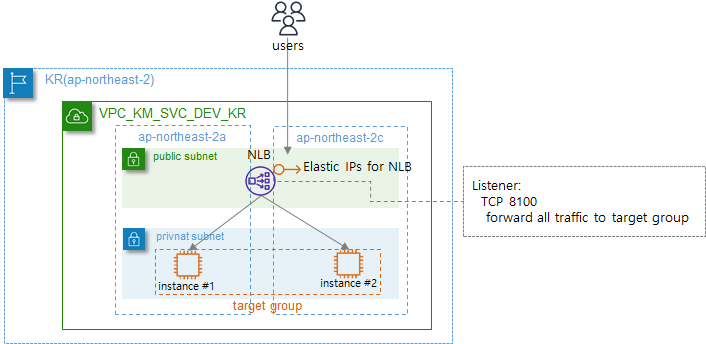
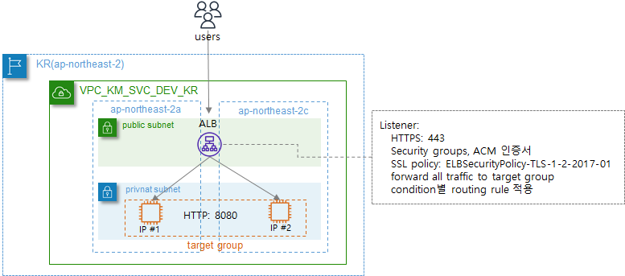

# AWS loadbalancer Module

AWS에 ELB(Application Load balancer, Network Load balancer, Gateway Load balancer)를 생성합니다. ELB에 대한 자세한 내용은 아래의 AWS 내용을 참고하도록 합니다.


✔  [`AWS ELB`](https://aws.amazon.com/ko/elasticloadbalancing/) - Elastic Load Balancing(ELB)은 하나 이상의 가용 영역(AZ)에 있는 여러 대상 및 가상 어플라이언스에서 들어오는 애플리케이션 트래픽을 자동으로 분산합니다. 일반적으로 on-premise에서 사용하는 L7, L4 스위치의 기능과 같으며, 아래의 표는 각 Loadbalancer 별 기능 비교입니다.

|                             기능                             |                  Application Load Balancer                   |                    Network Load Balancer                     |                    Gateway Load Balancer                     |
| :----------------------------------------------------------: | :----------------------------------------------------------: | :----------------------------------------------------------: | :----------------------------------------------------------: |
|                       로드 밸런서 유형                       |                            계층 7                            |                            계층 4                            |          계층 3 게이트웨이 + <br>계층 4 로드 밸런싱          |
|                          대상 유형                           |                     IP, 인스턴스, Lambda                     |           IP, 인스턴스, Application Load Balancer            |                         IP, 인스턴스                         |
|                    흐름/프록시 동작 종료                     |                              예                              |                              예                              |                            아니요                            |
|                       프로토콜 리스너                        |                      HTTP, HTTPS, gRPC                       |                        TCP, UDP, TLS                         |                              IP                              |
|                    다음을 통해 연결 가능                     |                             VIP                              |                             VIP                              |                      라우팅 테이블 항목                      |
|                          **계층 7**                          |                                                              |                                                              |                                                              |
|                           리디렉션                           |                              ✔                               |                                                              |                                                              |
|                          고정 응답                           |                              ✔                               |                                                              |                                                              |
|                    Desync Mitigation Mode                    |                              ✔                               |                                                              |                                                              |
|                    HTTP 헤더 기반 라우팅                     |                              ✔                               |                                                              |                                                              |
|                          HTTP2/gRPC                          |                              ✔                               |                                                              |                                                              |
|                  **일반적인 구성 및 특징**                   |                                                              |                                                              |                                                              |
|                          느린 시작                           |                              ✔                               |                                                              |                                                              |
|                         Outpost 지원                         |                              ✔                               |                                                              |                                                              |
|                          로컬 영역                           |                              ✔                               |                                                              |                                                              |
|                    IP 주소 - 고정, 탄력적                    |                                                              |                              ✔                               |                                                              |
|             Connection Draining(등록 취소 지원)              |                              ✔                               |                              ✔                               |                              ✔                               |
|               구성 가능한 유휴 연결 시간 초과                |                              ✔                               |                                                              |                                                              |
|                       PrivateLink 지원                       |                                                              |                         ✔ (TCP, TLS)                         |                          ✔ (GWLBE)                           |
|                          영역 격리                           |                                                              |                              ✔                               |                              ✔                               |
|                          세션 재개                           |                              ✔                               |                              ✔                               |                                                              |
|                      수명이 긴 TCP 연결                      |                                                              |                              ✔                               |                              ✔                               |
|           같은 인스턴스의 여러 포트로 로드 밸런싱            |                              ✔                               |                              ✔                               |                              ✔                               |
|                    로드 밸런서 삭제 방지                     |                              ✔                               |                              ✔                               |                              ✔                               |
|                      소스 IP 주소 유지                       |                              ✔                               |                              ✔                               |                              ✔                               |
|                          WebSocket                           |                              ✔                               |                              ✔                               |                              ✔                               |
|                   지원되는 네트워크/플랫폼                   |                             VPC                              |                             VPC                              |                             VPC                              |
|                    교차 영역 로드 밸런싱                     |                              ✔                               |                              ✔                               |                              ✔                               |
|               IAM 권한(리소스 기반, 태그 기반)               |                              ✔                               |                              ✔                               |                              ✔                               |
| 흐름 고정(흐름의 모든 패킷이 하나의 대상으로 전송되고 동일한 대상에서 반환 트래픽이 전송됨) |                             대칭                             |                             대칭                             |                             대칭                             |
|                      대상 장애 시 동작                       | 대상에 대해 장애 시 닫기(Fail Close), 모든 대상이 비정상이면 장애 시 열기(Fail Open) | 대상에 대해 장애 시 닫기(Fail Close), 모든 대상이 비정상이면 장애 시 열기(Fail Open) | 기존 흐름은 계속해서 기존 대상 어플라이언스로 전송되고, 새 흐름은 정상 상태인 대상 기기로 다시 라우팅 |
|                          상태 확인                           |                      HTTP, HTTPS, gRPC                       |                       TCP, HTTP, HTTPS                       |                       TCP, HTTP, HTTPS                       |
|                           **보안**                           |                                                              |                                                              |                                                              |
|                         SSL 오프로드                         |                              ✔                               |                              ✔                               |                                                              |
|                     SNI(서버 이름 표시)                      |                              ✔                               |                              ✔                               |                                                              |
|                      백엔드 서버 암호화                      |                              ✔                               |                              ✔                               |                                                              |
|                         사용자 인증                          |                              ✔                               |                                                              |                                                              |
|                    사용자 지정 보안 정책                     |                                                              |                                                              |                                                              |
|                             ALPN                             |                              ✔                               |                              ✔                               |                                                              |
|                   **Kubernetes 컨트롤러**                    |                                                              |                                                              |                                                              |
|                        포드 직접 연결                        |                              ✔                               |                       ✔ (Fargate Pods)                       |                                                              |
|               여러 네임스페이스로 로드 밸런싱                |                              ✔                               |                                                              |                                                              |
|               완전 프라이빗 EKS 클러스터 지원                |                              ✔                               |                              ✔                               |                                                              |
|                     **로깅 및 모니터링**                     |                                                              |                                                              |                                                              |
|                       CloudWatch 지표                        |                              ✔                               |                              ✔                               |                              ✔                               |
|                             로깅                             |                              ✔                               |                              ✔                               |                              ✔                               |


## 인프라 사전 준비사항

다음의 인프라가 사전에 설치되어 있어야만, 본 모듈을 사용하여 자원을 생성할 수 있습니다.

| AWS 인프라 |                          간단 설명                           | Required | 사용 가능 모듈 |
| :--------: | :----------------------------------------------------------: | :------: | :------------: |
|    VPC     | [AWS 가상 네트워크](https://docs.aws.amazon.com/ko_kr/vpc/latest/userguide/what-is-amazon-vpc.html) |  `yes`   |  network/vpc   |


## 사용예시

1. Network Load Balancer 생성




위와 같은 구성에서 NLB(Network Load Balancer)를 아래와 같은 코드로 생성할 수 있습니다. (※ 아래의 예시 코드에서는 이해를 돕기 위해 변수대신 값을 사용하였으며, 대부분 변수를 사용합니다.)

```yaml
1) Target group 생성
module target_group {
    source = "../../../modules/network/loadbalancer" #(Required) module source location
    svc_name = "km" #(Required)
    purpose = "svc" #(Required)
    env = "dev" #(Required)
    region_name_alias = "kr" #(Required)
    target_groups = {
        "sample" = { # (Required) key name이 target group name에 들어감 (ex, tg-sample-km-svc-dev-kr)
            target_type = "instance" #(Required) target resource type (instance, ip, alb, lambda 등)
            vpc_id = "vpc-******" #(Required) lambda를 제외하고 모두 vpc_id가 필요함
            port = 32145 #(Required) lambda를 제외하고 모두 target port가 필요함
            protocol = "TCP" #(Required) lambda를 제외하고 모두 protocol이 필요함
            targets = [ #(Required) target instance에 대한 정의
                {target_id = "i-******", port = 32145}, 
                {target_id = "i-******", port = 32145}
            ]
            stickiness = {enabled = true, type = "source_ip"} #(Optional) Sticky session 정의 여부
            proxy_protocol_v2 = false #(Optional) proxy protocol v2 사용 여부
            preserve_client_ip = true #(Optional) Client ip 보존 여부 (ip type 에서는 지원하지 않음)
        }
    }
}

2) Network Load Balancer 생성
module elb {
     source = "../../../modules/network/loadbalancer" #(Required) module source location
     svc_name = "km" #(Required)
     purpose = "svc" #(Required)
     env = "dev" #(Required) 
     region_name_alias = "kr" #(Required)
     elbs = {
        "sample" = { # (Required) key name이 NLB name에 들어감 (ex, nlb-sample-km-svc-dev-kr)
            type = "network" #(Optional) ELB type (network, application, gateway) default: application
            subnet_mapping = [{ #(Required) NLB의 경우, NLB를 위한 interface 생성 network 정의
            	subnet_id = "subnet-******", #(Required) 
                create_eip = true #(Optional) Elastic IP 신규 생성 여부
                availability_zone = "ap-northeast-2a" #(Required) avaiability zone 이름
            },
            {
                subnet_id = "subnet-******",
                create_eip = true
                availability_zone = "ap-northeast-2c"
            }]
            listeners = [{ # (Required) ELB listener 정의
                port = 8100 #(Required)
                protocol = "TCP" #(Required)
                default_action = { #(Required)
                    type = "forward" #(Required) default route action (forward, redirect etc...)
                    target_group_arn = module.target_group.target_group_arn_map["sample"]
                }
            }]
            enable_cross_zone_load_balancing = true #(Optional)
            access_logs = { #(Optional)
                bucket = "imsi-km-mgmt-dev-kr" #(Required) bucket name (id)
            }
        }
    }
}
```

- NLB에 대한 tag naming rule은 다음과 같으며, 이때 svc_name, purpose, env, region_name_alias와 같은 variable들은 tag를 생성할 때 suffix로 사용된다. (ex, nlb_sample_km_svc_dev_kr)

  > Target group: tg_\[name]\_[service_name]\_[purpose]\_[env]\_[region] ex) tg_sample_km_svc_dev_kr
  >
  > Network loadbalancer: nlb\_[name]\_[service name]\_[purpose]\_[env]\_[region] ex) nlb_sample_km_svc_dev_kr

- Target group에서 instance로 정상적인 health check가 수행 될 수 있도록 security group을 설정해야 한다.

  

2. Application Loadbalancer 생성

   

위와 같은 구성에서 ALB(Application Load Balancer)를 아래와 같은 코드로 생성할 수 있습니다. (※ 아래의 예시 코드에서는 이해를 돕기 위해 변수대신 값을 사용하였으며, 대부분 변수를 사용합니다.)

```yaml
1) Target group 생성
module target_group {
    source = "../../../modules/network/loadbalancer"
    svc_name = "km"
    purpose = "svc"
    env = "dev"
    region_name_alias = "kr"
    target_groups = {
        "sample" = {
            target_type = "ip"
            vpc_id = "vpc-******"
            port = 8080
            protocol = "HTTP"
            targets = [
                { target_id = "172.33.107.235", port = 8080 },
                { target_id = "172.33.207.200", port = 8080 }
            ]
            health_check = {
                enabled = true, path = "/healthz", protocol = "HTTP", matcher = "200"
            }
            stickiness = {enabled = false, type = "lb_cookie"}
            proxy_protocol_v2 = false
            load_balancing_algorithm_type = "least_outstanding_requests"
        }
    }
}

2) Application Load Balancer 생성
module elb {
     source = "../../../modules/network/loadbalancer"
     svc_name = "km"
     purpose = "svc"
     env = "dev"
     region_name_alias = "kr"
     elbs = {
        "sample" = {
            type = "application"
            security_groups = ["sg-*******"]
            enable_cross_zone_load_balancing = true
            subnets = ["subnet-*******", "subnet-*******"]
            listeners = [{
                port = 443
                protocol = "HTTPS"
                ssl_policy = "ELBSecurityPolicy-TLS-1-2-2017-01"
                certificate_arn = "arn:******"
                default_action = {
                    type = "forward"
                    forward = {
                        target_groups = [ {arn = module.target_group.target_group_arn_map["sample-ip"]}]
                        stickiness = {enabled = true, duration = 3600 }
                    }
                }
                rules = [
                    {
                        priority = 1
                        actions = [
                            {
                                type = "redirect"
                                redirect = {
                                    status_code = "HTTP_302"
                                    host = "jenkins.sample.com"
                                    path = "/admin"
                                    port = 443
                                    protocol = "HTTPS"
                                }
                            }
                        ]
                        conditions = [
                            { host_headers = ["jenkins.sample.com"] },
                            { http_headers = [{http_header_name = "sample", values = ["sample_value"]}] },
                            { path_patterns = ["/admin"] },
                            { query_strings = [{key = "sample", value = "sample"}] },
                            { source_ips = ["1.1.1.1/32"] }
                        ]
                    },
                    {
                        priority = 2
                        actions = [
                            {
                                type = "forward"
                                target_group_arn = module.target_group.target_group_arn_map["sample-ip"]
                            }
                        ],
                        conditions = [
                            { source_ips = ["1.1.1.2/32"] }, 
                            { path_patterns = ["/sample"] }
                        ]
                    },
                    {
                        priority = 3
                        actions = [{
                                type = "fixed-response"
                                fixed_response = {
                                    content_type = "text/plain"
                                    status_code = "200"
                                }
                        }]
                    }
                ]
           }
     }
}
```

- ALB에 대한 tag naming rule은 다음과 같으며, 이때 svc_name, purpose, env, region_name_alias와 같은 variable들은 tag를 생성할 때 suffix로 사용된다. (ex, nlb_sample_km_svc_dev_kr)

  > Target group: tg_\[name]\_[service_name]\_[purpose]\_[env]\_[region] ex) tg_sample_km_svc_dev_kr
  >
  > Network loadbalancer: alb\_[name]\_[service name]\_[purpose]\_[env]\_[region] ex) alb_sample_km_svc_dev_kr

- Target group에서 instance로 정상적인 health check가 수행 될 수 있도록 security group을 설정해야 한다.

  

## Requirements

| Name      | Version |
| :-------- | :-----: |
| terraform | >= 0.12 |


## Providers

| Name | Version |
| :--- | :-----: |
| aws  | >~ 4.0  |


## Resources

| Name                                                         |   Type   |
| :----------------------------------------------------------- | :------: |
| [aws_lb_target_group](https://registry.terraform.io/providers/hashicorp/aws/latest/docs/resources/lb_target_group) | resource |
| [aws_lb_target_group_attachment](https://registry.terraform.io/providers/hashicorp/aws/latest/docs/resources/lb_target_group_attachment) | resource |
| [aws_eip](https://registry.terraform.io/providers/hashicorp/aws/latest/docs/resources/eip) | resource |
| [aws_lb](https://registry.terraform.io/providers/hashicorp/aws/latest/docs/resources/lb) | resource |
| [aws_lb_listener](https://registry.terraform.io/providers/hashicorp/aws/latest/docs/resources/lb_listener) | resource |
| [aws_lb_listener_certificate](https://registry.terraform.io/providers/hashicorp/aws/latest/docs/resources/lb_listener_certificate) | resource |
| [aws_lb_listener_rule](https://registry.terraform.io/providers/hashicorp/aws/latest/docs/resources/lb_listener_rule) | resource |
| [aws_eks_fargate_profile](https://registry.terraform.io/providers/hashicorp/aws/latest/docs/resources/eks_fargate_profile) | resource |


## Inputs

| Name                                                         | Description                                                  |      Type      |    Default     | Required |
| :----------------------------------------------------------- | :----------------------------------------------------------- | :------------: | :------------: | :------: |
| svc_name                                                     | VPC의 사용 용도                             |    `string`    |                |  `yes`   |
| purpose                                                      | VPC의 용도를 나타낼 수 있는 서비스 명 (ex, svc / mgmt)       |    `string`    |                |  `yes`   |
| env                                                          | 시스템 구성 환경 (ex, dev / stg / prd)                       |    `string`    |                |  `yes`   |
| region_name_alias                                            | 서비스 AWS Region alias (ex, ap-northeast-2 → kr)            |    `string`    |                |  `yes`   |
| **target_groups**                                            | ALB, NLB에 할당할 target group 설정                          |     `any`      |      `{}`      |   `no`   |
| **target_groups**.target_type                                | target의 type설정 (`intance`, `ip`, `alb`, `lambda`)         |    `string`    |   `instance`   |   `no`   |
| **target_groups**.vpc_id                                     | target group을 생성할 VPC ID                                 |    `string`    |     `null`     |   `no`   |
| **target_groups**.port                                       | target이 traffic을 receive할 port 이며 lambda type은 설정이 필요 없다. |    `number`    |                |  `yes`   |
| **target_groups**.protocol                                   | `GENEVE`, `HTTP`, `HTTPS`, `TCP`, `TCP_UDP`, `TLS`, or `UDP` not for lambda |    `string`    |                |  `yes`   |
| **target_groups**.protocol_version                           | Only applicable when protocol is `HTTP` or `HTTPS`           |    `string`    |    `HTTP1`     |   `no`   |
| **target_groups**.proxy_protocol_v2                          | NLB에만 설정이 가능하며, proxy protocol v2를 사용 여부 설정  |     `bool`     |    `false`     |   `no`   |
| **target_groups**.preserve_client_ip                         | Client IP preserve기능을 사용할지 여부 설정                  |     `bool`     |    `false`     |   `no`   |
| **target_groups**.load_balancing_algorithm_type              | target 으로 traffic을 부하분산하기 위한 알고리즘 설정(`round_robin` or `least_outstanding_requests`) |    `string`    | `round_robin`  |   `no`   |
| **target_groups**.*targets*                                  | target group의 target 설정                                   | `list(object)` |      `[]`      |   `no`   |
| **target_groups**.*targets.*<br>target_id                    | target의 ID 설정 (`instance의` 경우, instance_id, `ip의` 경우 ip address) |    `string`    |                |  `yes`   |
| **target_groups**.*targets.*<br/>port                        | target이 traffic을 받기 위한 port 설정                       |    `number`    |     `null`     |   `no`   |
| **target_groups**.*targets.*<br/>availability_zone           | target의 IP주소가 mapping될 availability zone 설정           |    `string`    |     `null`     |   `no`   |
| **target_groups**.*health_check*                             | target group의 healthcheck 설정                              |    `object`    |     `null`     |   `no`   |
| **target_groups**.*health_check*.<br>enabled                 | healthcheck를 enable할지 여부 설정                           |     `bool`     |     `true`     |   `no`   |
| **target_groups**.*health_check*.<br/>healthy_threshold      | healthcheck 주기 설정                                        |    `number`    |      `30`      |   `no`   |
| **target_groups**.*health_check*.<br/>matcher                | healthy로 인정할 response code                               |    `string`    |                |  `yes`   |
| **target_groups**.*health_check*.<br/>path                   | healthcheck request의 URI (path)                             |    `string`    |                |  `yes`   |
| **target_groups**.*health_check*.<br/>port                   | healthcheck target port 설정                                 |    `number`    |     `null`     |   `no`   |
| **target_groups**.*health_check*.<br/>protocol               | healthcheck target protocol 설정                             |    `string`    |     `null`     |   `no`   |
| **target_groups**.*health_check*.<br/>timeout                | healthcheck에 대한 target의 response timeout 설정            |    `number`    |      `10`      |   `no`   |
| **target_groups**.*health_check*.<br/>unhealthy_threshold    | healthcheck를 몇번 연속 실패해야 unhealthy하다고 판단할지 설정 |    `number`    |      `3`       |   `no`   |
| **target_groups**.slow_start                                 | ELB가 target에 traffic을 full로 보내기 전에 target을 warm up하는데 필요한 시간 설정 |    `number`    |  `0(disable)`  |   `no`   |
| **target_groups**.deregistration_delay                       | target을 deregister하기 전 대기 시간 (traffic drain하기 위해 필요) |    `number`    |     `300`      |   `no`   |
| **target_groups**.connection_termination                     | deregistration timeout 이후에 강제로 connection을 close하는 기능 설정 (only for NLB) |     `bool`     |    `false`     |   `no`   |
| **target_groups**.*stickiness*                               | traffic session stickiness 설정                              |    `object`    |     `null`     |   `no`   |
| **target_groups**.*stickiness*.<br>enabled                   | session stickiness 사용 여부 설정                            |     `bool`     |     `true`     |   `no`   |
| **target_groups**.*stickiness*.<br/>type                     | The type of sticky sessions (`lb_cookie`, `app_cookie` for ALBs, and `source_ip` for NLBs) |    `string`    |                |  `yes`   |
| **target_groups**.*stickiness*.<br/>cookie_duration          | cookie duration time 설정 (`lb_cookie` type인 경우만 해당)   |    `number`    |    `86400`     |  `yes`   |
| **target_groups**.*stickiness*.<br/>cookie_name              | Name of the application based cookie                         |    `string`    |     `null`     |   `no`   |
| **target_groups**.lambda_multi_value_headers_enabled         | 람다와 ELB간 통신 시, strings 또는 value list를 사용할 지 여부 (only for `lambda` type) |     `bool`     |    `false`     |   `no`   |
| **target_groups**.tags                                       | target group resource tag 설정                               | `map(string)`  |      `{}`      |   `no`   |
| **elbs**                                                     | Elastic Load Balancer 설정                                   |     `any`      |      `{}`      |   `no`   |
| **elbs**.type                                                | Elastic Load Balancer type (`application`, `gateway`, or `network`) |    `string`    | `application`  |   `no`   |
| **elbs**.internal                                            | Internal ELB 여부                                            |     `bool`     |    `false`     |   `no`   |
| **elbs**.security_groups                                     | [ALB] ELB에 할당할 security group설정                        | `list(string)` |      `[]`      |   `no`   |
| **elbs**.subnets                                             | [ALB] ELB가 생성될 subnet IDs                                | `list(string)` |      `[]`      |   `no`   |
| **elbs**.*subnet_mapping*                                    | [NLB] ELB가 생성될 subnet 정의                               | `list(object)` |      `[]`      |   `no`   |
| **elbs**.*subnet_mapping*.<br>subnet_id                      | [NLB] ELB를 mapping할 subnet ID                              |    `string`    |                |  `yes`   |
| **elbs**.*subnet_mapping*.<br/>create_eip                    | [NLB] EIP를 NLB에 할당할지 여부 설정                         |     `bool`     |    `false`     |   `no`   |
| **elbs**.*subnet_mapping*.<br/>availability_zone             | [NLB] NLB를 생성할 availability zone을 설정(create_eip가 true인 경우 required variable) |    `string`    |     `null`     |   `no`   |
| **elbs**.*subnet_mapping*.<br/>allocation_id                 | [NLB] 만일 기 생성된 eip가 존재하는 경우, 해당 eip의 allocation id를 사용하여 mapping 가능함 |    `string`    |     `null`     |   `no`   |
| **elbs**.*subnet_mapping*.<br/>private_ipv4_address          | [NLB] interal ELB의 경우 private ip address를 설정할 수 있다. |    `string`    |     `null`     |   `no`   |
| **elbs**.*subnet_mapping*.<br/>ipv6_address                  | [NLB] internet ELB에 할당할 ipv6 주소를 설정할 수 있다.      |    `string`    |     `null`     |   `no`   |
| **elbs**.ip_address_type                                     | ELB의 ip address type (`ipv4`, `dualstack`)                  |    `string`    |     `ipv4`     |   `no`   |
| **elbs**.drop_invalid_header_fields                          | http header에 invalid한 field가 있는 경우, ELB가 제거하고 target으로 전송하도록 설정 |     `bool`     |    `false`     |   `no`   |
| **elbs**.*access_logs*                                       | ELB의 access log를 설정한다.                                 |    `object`    |     `null`     |   `no`   |
| **elbs**.*access_logs*.<br>bucket                            | access log를 저장할 s3 bucket 이름 설정                      |    `string`    |                |  `yes`   |
| **elbs**.*access_logs*.<br/>prefix                           | access log를 저장할 s3 bucket prefix 설정                    |    `string`    |                |  `yes`   |
| **elbs**.*access_logs*.<br/>enabled                          | access log를 사용할지 말지 설정                              |     `bool`     |    `false`     |   `no`   |
| **elbs**.idle_timeout                                        | [ALB] connection idle timeout 설정                           |    `number`    |      `60`      |   `no`   |
| **elbs**.enable_deletion_protection                          | AWS API에 의해서 ELB가 삭제되는것을 허용할지 여부 설정       |     `bool`     |    `false`     |   `no`   |
| **elbs**.enable_cross_zone_load_balancing                    | [NLB] Cross zone loadbalancing을 사용할지 여부 설정          |     `bool`     |    `false`     |   `no`   |
| **elbs**.enable_http2                                        | [ALB] HTTP/2를 허용할지 여부 설정                            |     `bool`     |     `true`     |   `no`   |
| **elbs**.enable_waf_fail_open                                | WAF로 보낼 수 없는 request를 target으로 forward할 것인지 여부 설정 |     `bool`     |    `false`     |   `no`   |
| **elbs**.customer_owned_ipv4_pool                            | customer가 보유한 public ip address pool을 사용하여 ELB에 ip를 할당 설정 |    `string`    |     `null`     |   `no`   |
| **elbs**.desync_mitigation_mode                              | HTTP desync에 의한 보안 위험을 최소화 할 수 있는 방안을 설정(`monitor`,`defensive`,`strictest`) |    `string`    |  `defensive`   |   `no`   |
| **elbs**.*listeners*                                         | ELB가 사용할 listener를 설정                                 | `list(object)` |      `[]`      |   `no`   |
| **elbs**.*listeners*.<br>port                                | Listener port 설정 (GLB는 설정하지 않음)                     |    `number`    |     `null`     |   `no`   |
| **elbs**.*listeners*.<br/>protocol                           | Listener protocol 설정 (ALB: `HTTP`,`HTTPS`, NLB: `TCP`,`TLS`,`UDP`,`TCP_UDP`) |    `string`    |     `HTTP`     |   `no`   |
| **elbs**.*listeners*.<br/>ssl_policy                         | Listener의 SSL policy 설정                                   |    `string`    |     `null`     |   `no`   |
| **elbs**.*listeners*.<br/>certificate_arn                    | SSL 인증서 Certificate Manager ARN 설정                      |    `string`    |     `null`     |   `no`   |
| **elbs**.*listeners*.<br/>additional_certificate_arns        | SSL 추가 인증서 Certificate Manager ARN 설정                 |    `string`    |     `null`     |   `no`   |
| **elbs**.*listeners*.<br/>alpn_policy                        | protocol이 TLS인 경우, Application-Layer Protocol Negotiation(ALPN) policy (`HTTP1Only`, `HTTP2Only`, `HTTP2Optional`, `HTTP2Preferred`, `None`) |    `string`    |     `None`     |   `no`   |
| **elbs**.*listeners*.*default_action*                        | Listener의 default action 정의                               |    `object`    |                |  `yes`   |
| **elbs**.*listeners*.*default_action*.<br>type               | action type설정 (`forward`, `redirect`, `fixed-response`, `authenticate-cognito`, `authenticate-oidc`) |    `string`    |   `forward`    |   `no`   |
| **elbs**.*listeners*.*default_action*.<br/>order             | 여러개의 action이 있을 경우 필요하며, 1 ~ 50000의 값을 가진다. |    `number`    |      `1`       |   `no`   |
| **elbs**.*listeners*.*default_action*.<br/>target_group_arn  | target group의 이름 설정 (`forward` type에서 required variable) |    `string`    |                |  `yes`   |
| **elbs**.*listeners*.*default_action*.*authenticate_cognito* | `authenticate-cognito` type ELB 설정                         |    `object`    |     `null`     |   `no`   |
| **elbs**.*listeners*.*default_action*.*authenticate_cognito*.<br>user_pool_arn | Cognito user pool ARN 설정                                   |    `string`    |                |  `yes`   |
| **elbs**.*listeners*.*default_action*.*authenticate_cognito*.<br/>user_pool_client_id | Cognito client app ID 설정                                   |    `string`    |                |  `yes`   |
| **elbs**.*listeners*.*default_action*.*authenticate_cognito*.<br/>user_pool_domain | Cognito user pool Domain name 설정                           |    `string`    |                |  `yes`   |
| **elbs**.*listeners*.*default_action*.*authenticate_cognito*.<br/>authentication_request_extra_params | Cognito에 전달할 인증관련 parameter 정의                     | `map(string)`  |      `{}`      |   `no`   |
| **elbs**.*listeners*.*default_action*.*authenticate_cognito*.<br/>on_unauthenticated_request | 인증 받지 못한 경우 action (`deny`, `allow`, `authenticate`) |    `string`    | `authenticate` |   `no`   |
| **elbs**.*listeners*.*default_action*.*authenticate_cognito*.<br/>scope | IdP(Id Provider)로 부터 요청되는 user claim set (ex email)   |    `string`    |     `null`     |   `no`   |
| **elbs**.*listeners*.*default_action*.*authenticate_cognito*.<br/>session_cookie_name | login session cookie name 설정                               |    `string`    |     `null`     |   `no`   |
| **elbs**.*listeners*.*default_action*.*authenticate_cognito*.<br/>session_timeout | login session timeout 설정                                   |    `number`    | `604,800(7d)`  |   `no`   |
| **elbs**.*listeners*.*default_action*.*authenticate_oidc*    | `authenticate-oidc` type ELB 설정                            |    `object`    |     `null`     |   `no`   |
| **elbs**.*listeners*.*default_action*.*authenticate_oidc*.<br>authorization_endpoint | OIDC endpoint URL 설정                                       |    `string`    |                |  `yes`   |
| **elbs**.*listeners*.*default_action*.*authenticate_oidc*.<br/>client_id | OAuth 2.0 client identifier 설정                             |    `string`    |                |  `yes`   |
| **elbs**.*listeners*.*default_action*.*authenticate_oidc*.<br/>client_secret | OAuth 2.0 client secret 설정                                 |    `string`    |                |  `yes`   |
| **elbs**.*listeners*.*default_action*.*authenticate_oidc*.<br/>issuer | OIDC issuer identifier of the IdP                            |    `string`    |                |  `yes`   |
| **elbs**.*listeners*.*default_action*.*authenticate_oidc*.<br/>token_endpoint | Token endpoint of the IdP                                    |    `string`    |                |  `yes`   |
| **elbs**.*listeners*.*default_action*.*authenticate_oidc*.<br/>user_info_endpoint | User info endpoint of the IdP                                |    `string`    |                |  `yes`   |
| **elbs**.*listeners*.*default_action*.*authenticate_oidc*.<br/>authentication_request_extra_params | IdP에 전달할 인증관련 parameter 정의                         | `map(string)`  |      `{}`      |   `no`   |
| **elbs**.*listeners*.*default_action*.*authenticate_oidc*.<br/>on_unauthenticated_request | 인증 받지 못한 경우 action (`deny`, `allow`, `authenticate`) |    `string`    | `authenticate` |   `no`   |
| **elbs**.*listeners*.*default_action*.*authenticate_oidc*.<br/>scope | IdP(Id Provider)로 부터 요청되는 user claim set (ex email)   |    `string`    |     `null`     |   `no`   |
| **elbs**.*listeners*.*default_action*.*authenticate_oidc*.<br/>session_cookie_name | login session cookie name 설정                               |    `string`    |     `null`     |   `no`   |
| **elbs**.*listeners*.*default_action*.*authenticate_oidc*.<br/>session_timeout | login session timeout 설정                                   |    `number`    | `604,800(7d)`  |   `no`   |
| **elbs**.*listeners*.*default_action*.*fixed_response*       | 요청에 대해 고정된 response를 보낼 때 설정한다.              |    `object`    |     `null`     |   `no`   |
| **elbs**.*listeners*.*default_action*.*fixed_response*.<br>content_type | HTTP content type을 설정 (`text/plain`, `text/css`, `text/html`, `application/javascript` ,`application/json`) |    `string`    |                |  `yes`   |
| **elbs**.*listeners*.*default_action*.*fixed_response*.<br/>message_body | HTTP Message body                                            |    `string`    |     `null`     |   `no`   |
| **elbs**.*listeners*.*default_action*.*fixed_response*.<br/>status_code | HTTP response code (2xx, 4xx, 5xx 등)                        |    `string`    |     `null`     |   `no`   |
| **elbs**.*listeners*.*default_action*.*weighted_forward*     | target group이 여러개 있을 경우, 가중치 기반 forward를 수행할때 설정 |    `object`    |     `null`     |   `no`   |
| **elbs**.*listeners*.*default_action*.*weighted_forward*.*target_groups* | weighted forward를 위한 target group설정                     | `list(object)` |                |  `yes`   |
| **elbs**.*listeners*.*default_action*.*weighted_forward*.*target_groups*.<br>name | target group 이름                                            |    `string`    |                |  `yes`   |
| **elbs**.*listeners*.*default_action*.*weighted_forward*.*target_groups*.<br/>weight | forward 가중치 (우선순위, 0 ~ 999)                           |    `number`    |      `0`       |   `no`   |
| **elbs**.*listeners*.*default_action*.*weighted_forward*.*stickiness* | target group stickiness 설정                                 |    `object`    |     `null`     |   `no`   |
| **elbs**.*listeners*.*default_action*.*weighted_forward*.*stickiness*.<br>enabled | target group stickiness 사용여부 설정                        |     `bool`     |    `false`     |   `no`   |
| **elbs**.*listeners*.*default_action*.*weighted_forward*.*stickiness*.<br/>duration | target group stickiness duration 설정 (1 ~ 604800(7d))       |    `number`    |                |  `yes`   |
| **elbs**.*listeners*.*default_action*.*redirect*             | traffic을 redirect하는데 사용되는 설정                       |    `object`    |                |   `no`   |
| **elbs**.*listeners*.*default_action*.*redirect*.<br>status_code | HTTP redirect code. The redirect is either permanent (HTTP_301) or temporary (HTTP_302) |    `string`    |                |  `yes`   |
| **elbs**.*listeners*.*default_action*.*redirect*.<br/>host   | target hostname                                              |    `string`    |   `#{host}`    |   `no`   |
| **elbs**.*listeners*.*default_action*.*redirect*.<br/>path   | absolute path, starting with the leading "/"                 |    `string`    |   `#{path}`    |   `no`   |
| **elbs**.*listeners*.*default_action*.*redirect*.<br/>port   | target port number 설정                                      |    `number`    |   `#{port}`    |   `no`   |
| **elbs**.*listeners*.*default_action*.*redirect*.<br/>protocol | target protocol 설정 (`HTTP`, `HTTPS`)                       |    `string`    | `#{protocol}`  |   `no`   |
| **elbs**.*listeners*.*default_action*.*redirect*.<br/>query  | query parameter이고 ?는 제외한 string 값을 설정한다.         |    `string`    |   `#{query}`   |   `no`   |
| **elbs**.*rules*                                             | routing rule을 설정한다.                                     | `list(object)` |      `[]`      |   `no`   |
| **elbs**.*rules*.<br>priority                                | Rule의 priority 설정 (1 ~ 50000)                             |    `number`    |      `1`       |   `no`   |
| **elbs**.*rules*.*conditions*                                | Rule을 적용할 condition설정                                  | `list(object)` |      `[]`      |   `no`   |
| **elbs**.*rules*.*conditions*.<br>host_headers               | HTTP header에서 host 와 match pattern설정                    | `list(string)` |      `[]`      |   `no`   |
| **elbs**.*rules*.*conditions*.*http_headers*                 | HTTP header의 특정 field에 대한 match pattern 설정           | `list(object)` |      `[]`      |   `no`   |
| **elbs**.*rules*.*conditions*.*http_headers*.<br>http_header_name | HTTP header field name 설정                                  |    `string`    |                |  `yes`   |
| **elbs**.*rules*.*conditions*.*http_headers*.<br/>values     | HTTP header field 에 대한 values 설정                        | `list(string)` |                |  `yes`   |
| **elbs**.*rules*.*conditions*.<br/>http_request_methods      | HTTP request method를 설정                                   | `list(string)` |      `[]`      |   `no`   |
| **elbs**.*rules*.*conditions*.<br/>path_patterns             | HTTP URL path pattern 설정                                   | `list(string)` |      `[]`      |   `no`   |
| **elbs**.*rules*.*conditions*.*query_strings*                | query string match pattern                                   | `list(object)` |      `[]`      |   `no`   |
| **elbs**.*rules*.*conditions*.*query_strings*.<br>key        | Query string key pattern to match                            |    `string`    |     `null`     |   `no`   |
| **elbs**.*rules*.*conditions*.*query_strings*.<br/>value     | Query string value pattern to match                          |    `string`    |                |  `yes`   |
| **elbs**.*rules*.*conditions*.<br/>source_ips                | Source ip addresses 설정                                     | `list(string)` |      `[]`      |   `no`   |
| **elbs**.*rules*.*actions*                                   | Condition에 match되는 request에 대한 action들을 설정         | `list(object)` |      `[]`      |   `no`   |
| **elbs**.*rules*.*actions*.<br>type                          | Type of routing action (`forward`, `redirect`, `fixed-response`, `authenticate-cognito`, `authenticate-oidc`) |    `string`    |                |  `yes`   |
| **elbs**.*rules*.*actions*.<br/>target_group_name            | traffic을 전달할 target group name 설정 (`forward` type에는 required variable) |    `string`    |                |  `yes`   |
| **elbs**.*rules*.*actions*.*weighted_forward*                | target group이 여러개 있을 경우, 가중치 기반 forward를 수행할때 설정 |    `object`    |     `null`     |   `no`   |
| **elbs**.*rules*.*actions*.*weighted_forward*.*target_groups* | weighted forward를 위한 target group설정                     | `list(object)` |                |  `yes`   |
| **elbs**.*rules*.*actions*.*weighted_forward*.*target_groups*.<br>name | target group 이름                                            |    `string`    |                |  `yes`   |
| **elbs**.*rules*.*actions*.*weighted_forward*.*target_groups*.<br/>weight | forward 가중치 (우선순위, 0 ~ 999)                           |    `number`    |      `0`       |   `no`   |
| **elbs**.*rules*.*actions*.*weighted_forward*.*stickiness*   | target group stickiness 설정                                 |    `object`    |     `null`     |   `no`   |
| **elbs**.*rules*.*actions*.*weighted_forward*.*stickiness*.<br>enabled | target group stickiness 사용여부 설정                        |     `bool`     |    `false`     |   `no`   |
| **elbs**.*rules*.*actions*.*weighted_forward*.*stickiness*.<br/>duration | target group stickiness duration 설정 (1 ~ 604800(7d))       |    `number`    |                |  `yes`   |
| **elbs**.*rules*.*actions*.*redirect*                        | traffic을 redirect하는데 사용되는 설정                       |    `object`    |                |   `no`   |
| **elbs**.*rules*.*actions*.*redirect*.<br>status_code        | HTTP redirect code. The redirect is either permanent (HTTP_301) or temporary (HTTP_302) |    `string`    |                |  `yes`   |
| **elbs**.*rules*.*actions*.*redirect*.<br/>host              | target hostname                                              |    `string`    |   `#{host}`    |   `no`   |
| **elbs**.*rules*.*actions*.*redirect*.<br/>path              | absolute path, starting with the leading "/"                 |    `string`    |   `#{path}`    |   `no`   |
| **elbs**.*rules*.*actions*.*redirect*.<br/>port              | target port number 설정                                      |    `number`    |   `#{port}`    |   `no`   |
| **elbs**.*rules*.*actions*.*redirect*.<br/>protocol          | target protocol 설정 (`HTTP`, `HTTPS`)                       |    `string`    | `#{protocol}`  |   `no`   |
| **elbs**.*rules*.*actions*.*redirect*.<br/>query             | query parameter이고 ?는 제외한 string 값을 설정한다.         |    `string`    |   `#{query}`   |   `no`   |
| **elbs**.*rules*.*actions*.*fixed_response*                  | 요청에 대해 고정된 response를 보낼 때 설정한다.              |    `object`    |     `null`     |   `no`   |
| **elbs**.*rules*.*actions*.*fixed_response*.<br>content_type | HTTP content type을 설정 (`text/plain`, `text/css`, `text/html`, `application/javascript` ,`application/json`) |    `string`    |                |  `yes`   |
| **elbs**.*rules*.*actions*.*fixed_response*.<br/>message_body | HTTP Message body                                            |    `string`    |     `null`     |   `no`   |
| **elbs**.*rules*.*actions*.*fixed_response*.<br/>status_code | HTTP response code (2xx, 4xx, 5xx 등)                        |    `string`    |     `null`     |   `no`   |
| **elbs**.*rules*.*actions*.*authenticate_cognito*            | `authenticate-cognito` type ELB 설정                         |    `object`    |     `null`     |   `no`   |
| **elbs**.*rules*.*actions*.*authenticate_cognito*.<br>user_pool_arn | Cognito user pool ARN 설정                                   |    `string`    |                |  `yes`   |
| **elbs**.*rules*.*actions*.*authenticate_cognito*.<br/>user_pool_client_id | Cognito client app ID 설정                                   |    `string`    |                |  `yes`   |
| **elbs**.*rules*.*actions*.*authenticate_cognito*.<br/>user_pool_domain | Cognito user pool Domain name 설정                           |    `string`    |                |  `yes`   |
| **elbs**.*rules*.*actions*.*authenticate_cognito*.<br/>authentication_request_extra_params | Cognito에 전달할 인증관련 parameter 정의                     | `map(string)`  |      `{}`      |   `no`   |
| **elbs**.*rules*.*actions*.*authenticate_cognito*.<br/>on_unauthenticated_request | 인증 받지 못한 경우 action (`deny`, `allow`, `authenticate`) |    `string`    | `authenticate` |   `no`   |
| **elbs**.*rules*.*actions*.*authenticate_cognito*.<br/>scope | IdP(Id Provider)로 부터 요청되는 user claim set (ex email)   |    `string`    |     `null`     |   `no`   |
| **elbs**.*rules*.*actions*.*authenticate_cognito*.<br/>session_cookie_name | login session cookie name 설정                               |    `string`    |     `null`     |   `no`   |
| **elbs**.*rules*.*actions*.*authenticate_cognito*.<br/>session_timeout | login session timeout 설정                                   |    `number`    | `604,800(7d)`  |   `no`   |
| **elbs**.*rules*.*actions*.*authenticate_oidc*               | `authenticate-oidc` type ELB 설정                            |    `object`    |     `null`     |   `no`   |
| **elbs**.*rules*.*actions*.*authenticate_oidc*.<br>authorization_endpoint | OIDC endpoint URL 설정                                       |    `string`    |                |  `yes`   |
| **elbs**.*rules*.*actions*.*authenticate_oidc*.<br/>client_id | OAuth 2.0 client identifier 설정                             |    `string`    |                |  `yes`   |
| **elbs**.*rules*.*actions*.*authenticate_oidc*.<br/>client_secret | OAuth 2.0 client secret 설정                                 |    `string`    |                |  `yes`   |
| **elbs**.*rules*.*actions*.*authenticate_oidc*.<br/>issuer   | OIDC issuer identifier of the IdP                            |    `string`    |                |  `yes`   |
| **elbs**.*rules*.*actions*.*authenticate_oidc*.<br/>token_endpoint | Token endpoint of the IdP                                    |    `string`    |                |  `yes`   |
| **elbs**.*rules*.*actions*.*authenticate_oidc*.<br/>user_info_endpoint | User info endpoint of the IdP                                |    `string`    |                |  `yes`   |
| **elbs**.*rules*.*actions*.*authenticate_oidc*.<br/>authentication_request_extra_params | IdP에 전달할 인증관련 parameter 정의                         | `map(string)`  |      `{}`      |   `no`   |
| **elbs**.*rules*.*actions*.*authenticate_oidc*.<br/>on_unauthenticated_request | 인증 받지 못한 경우 action (`deny`, `allow`, `authenticate`) |    `string`    | `authenticate` |   `no`   |
| **elbs**.*rules*.*actions*.*authenticate_oidc*.<br/>scope    | IdP(Id Provider)로 부터 요청되는 user claim set (ex email)   |    `string`    |     `null`     |   `no`   |
| **elbs**.*rules*.*actions*.*authenticate_oidc*.<br/>session_cookie_name | login session cookie name 설정                               |    `string`    |     `null`     |   `no`   |
| **elbs**.*rules*.*actions*.*authenticate_oidc*.<br/>session_timeout | login session timeout 설정                                   |    `number`    | `604,800(7d)`  |   `no`   |
| **elbs**.tags                                                | ELB resource tags 설정                                       | `map(string)`  |      `{}`      |   `no`   |
- **target_groups**.proxy_protocol_v2: proxy protocol v2는 http header를 binary로 encoding하여 사용함을 주의

### 참고

------

`target_groups` - target_groups input variable은 아래와 같은 구조로 구성되어 있다. (실제 variable type은 any이나 아래와 같은 구조로 사용됨을 참고)

```yaml
type = map(object({
    target_type = string #(Required) 
    vpc_id = string #(Optional) 
    port = number #(May be required, Forces new resource) 
    protocol = string # (May be required, Forces new resource) 
    protocol_version = string # (Optional, Forces new resource) 
    proxy_protocol_v2 = bool #(Optional) 
    preserve_client_ip = bool #(Optional)
    load_balancing_algorithm_type = string #(Optional)
    targets = list(object({ #(Optional) 
        target_id = string #(Required) 
        port = number #(Optional) 
        availability_zone = string #(Optional) 
    }))
    health_check = object({
        enabled = bool # (Optional)
        healthy_threshold = number #(Optional) 
        matcher = string #(May be required) 
        path = string #(May be required) 
        port = number #(Optional) 
        protocol = string #(Optional) 
        timeout = number #(Optional) 
        unhealthy_threshold = number #(Optional) 
    })
    slow_start = string #(Optional) 
    deregistration_delay = number # (Optional)
    connection_termination = bool #(NLB, Optional) 
    stickiness = object({
        enabled = bool #(Optional)
        type = string #(Required) 
        cookie_duration = number #(Optional) 
        cookie_name = string #(Optional) 
    })
    lambda_multi_value_headers_enabled = bool #(Lambda, Optional) 
    tags = map(string) #(Optional) 
}))
```

`elbs` - elbs input variable은 아래와 같은 구조로 구성되어 있다. (실제 variable type은 any이나 아래와 같은 구조로 사용됨을 참고)

```yaml
type = map(object({
    type = string #(Optional) 
    internal = bool #(Optional)
    security_groups = list(string) #(ALB, Optional)
    subnets = list(string) #(ALB, Optional) 
    subnet_mapping = list(object({ #(NLB, Optional) 
        subnet_id = string #(Required) 
        create_eip = bool #(Optional)  
        availability_zone = string #(Required if create_eip is true)
        allocation_id = string #(Optional) 
        private_ipv4_address = string #(Optional) 
        ipv6_address = string #(Optional) 
    }))
    ip_address_type = string #(Optional) 
    drop_invalid_header_fields = bool #(Optional) 
    access_logs = object({ #(Optional) 
        bucket = string # (Required)
        prefix = string # (Required)
        enabled = bool # (Required)
    })
    idle_timeout = number #(ALB, Optional)
    enable_deletion_protection = bool #(Optional) 
    enable_cross_zone_load_balancing = bool # (NLB, Optional) 
    enable_http2 = bool #(ALB, Optional)
    enable_waf_fail_open = bool #(Optional) 
    customer_owned_ipv4_pool = string # (Optional) 
    desync_mitigation_mode = string # (Optional)     
    listeners = list(object({
        port = number #(Optional) 
        protocol = string #(Optional) 
        ssl_policy = string #(Optional) 
        certificate_arn = string #(Optional) 
        additional_certificate_arns = list(string) #(Optional) 
        alpn_policy = string #(Optional) 
        
        default_action = object({ #(Required) 
            type = string #(Required) 
            order = number #(Optional) 
            target_group_name = string #(forward, Optional) 
            authenticate_cognito = object({ #(Optional) 
                user_pool_arn = string #(Required) 
                user_pool_client_id = string #(Required)
                user_pool_domain = string #(Required)
                authentication_request_extra_params = map(string)
                on_unauthenticated_request = string #(Optional)
                scope = string #(Optional) 
                session_cookie_name = string #(Optional) 
                session_timeout = number # (Optional) 
            })
            authenticate_oidc = object({ #(Optional) 
                authorization_endpoint = string #(Required)
                client_id = string #(Required) 
                client_secret = string #(Required) 
                issuer = string #(Required) 
                token_endpoint = string #(Required) 
                user_info_endpoint = string #(Required) 
                authentication_request_extra_params = map(string) #(Optional) 
                on_unauthenticated_request = string #(Optional) 
                scope = string #(Optional) 
                session_cookie_name = string #(Optional) 
                session_timeout = string #(Optional) 
            })
            fixed_response = object({ #(Optional) 
                content_type = string #(Required) 
                message_body = string #(Optional) 
                status_code = string #(Optional) 
            })
            weighted_forward = object({ #(Optional) 
                target_groups = list(object({ #(Required) 
                    name = string #(Required) 
                    weight = number #(Optional) 
                }))
                stickiness = object({
                    duration = number #(Required) 
                    enabled = bool #(Optional) 
                })
            })
            redirect = object({ #(Optional) 
                status_code = string #(Required) 
                host = string #(Optional) 
                path = string #(Optional) 
                port = number #(Optional) 
                protocol = string #(Optional) 
                query = string #(Optional)
            })
        }) // End of default_action
        
        rules = list(object({
            priority = number #(Optional) 
            actions = list(object({
                type = string #(Required) 
                target_group_name = string #(forward, Optional) 
                weighted_forward = object({ #(Optional) 
                    target_groups = list(object({ #(Required) 
                        name = string #(Required) 
                        weight = number #(Optional) 
                    }))
                    stickiness = object({
                        duration = number #(Required) 
                        enabled = bool #(Optional) 
                    })
                })
                redirect = object({ #(Optional) 
                    status_code = string #(Required) 
                    host = string #(Optional) 
                    path = string #(Optional) 
                    port = number #(Optional) 
                    protocol = string #(Optional) 
                    query = string #(Optional) 
                })
                fixed_response = object({ #(Optional) 
                    content_type = string #(Required) 
                    message_body = string #(Optional) 
                    status_code = string #(Optional) 
                })
                authenticate_cognito = object({ #(Optional) 
                    user_pool_arn = string #(Required) 
                    user_pool_client_id = string #(Required) 
                    user_pool_domain = string #(Required) 
                    authentication_request_extra_params = map(string)
                    on_unauthenticated_request = string #(Optional) 
                    scope = string #(Optional) 
                    session_cookie_name = string #(Optional) 
                    session_timeout = number # (Optional) 
                })
                authenticate_oidc = object({ #(Optional) 
                    authorization_endpoint = string #(Required) 
                    client_id = string #(Required) 
                    client_secret = string #(Required) 
                    issuer = string #(Required) 
                    token_endpoint = string #(Required) 
                    user_info_endpoint = string #(Required) 
                    authentication_request_extra_params = map(string) #(Optional) 
                    on_unauthenticated_request = string #(Optional) 
                    scope = string #(Optional) 
                    session_cookie_name = string #(Optional) 
                    session_timeout = string #(Optional)
                })
            })) // End of actions
            conditions = list(object({
                host_headers = list(string) #(Optional) 
                http_headers = list(object({ #(Optional) 
                    http_header_name = string
                    values = list(string)
                }))
                http_request_methods = list(string) #(Optional) 
                path_patterns = list(string) #(Optional) 
                query_strings = list(object({ #(Optional) 
                    key = string #(Optional) 
                    value = string #(Required) 
                }))
                source_ips = list(string) #(Optional)
            }))
        })) // End of conditions
        tags = map(string)
    })) // End of rules
    tags = map(string)
}))
```


## Outputs

| Name                  | Description                    |
| :-------------------- | :----------------------------- |
| elb_arn_map           | ELB key: ARN map 정보          |
| elb_id_map            | ELB key: ID map 정보           |
| elb_name_map          | ELB key: NAME map 정보         |
| elb_dns_name_map      | ELB key: DNS_NAME map 정보     |
| target_group_arn_map  | target group key: ARN map정보  |
| target_group_id_map   | target group key: ID map정보   |
| target_group_name_map | target group key: NAME map정보 |
| nlb_eip_map           | NLB key: EIP map 정보          |
| listener_arn_map      | ELB listener key: ARN map 정보 |
| listener_id_map       | ELB listener key: ID map 정보  |