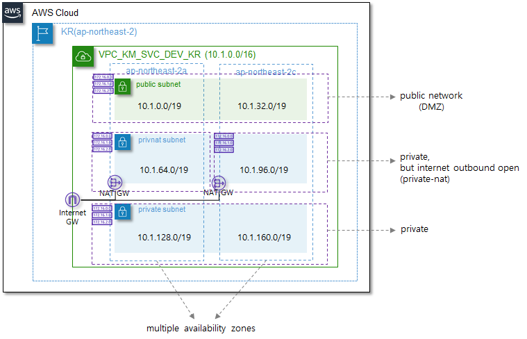

# AWS vpc Module

AWS Virtual Private Network를 구성하는 모듈이며, AWS network 구성요소 중, VPC, subnet, route table, internet gateway, nat gateway, nat gateway용 eip, network acl을 구성하게 됩니다.
본 VPC모듈은 네트워크를 크게 public(외부와 inbound/outbound 인터넷 통신 가능), private-nat(private zone이나 outbound 인터넷 통신이 가능), private(외부와의 통신 단절) 3개 tier로 구성하며, 기본 2개 이상의 availability zone을 구성하여, 장애에 대비하는 네트워크 아키텍처를 구현합니다.


VPC에 대한 자세한 내용은 아래의 AWS 내용을 확인해 보시기 바랍니다.

> ✔  [`AWS VPC`](https://docs.aws.amazon.com/ko_kr/vpc/latest/userguide/what-is-amazon-vpc.html) - Amazon Virtual Private Cloud(Amazon VPC)를 이용하면 사용자가 정의한 가상 네트워크로 AWS 리소스를 시작할 수 있습니다. 
> 이 가상 네트워크는 의 확장 가능한 인프라를 사용한다는 이점과 함께 고객의 자체 데이터 센터에서 운영하는 기존 네트워크와 매우 유사합니다. 


## 인프라 사전 준비사항

#### 	N/A


## 사용예시




위와 같은 구성에서 VPC를 아래와 같은 코드로 생성할 수 있습니다. (※ 아래의 예시 코드에서는 이해를 돕기 위해 변수대신 값을 사용하였으며, 대부분 변수를 사용합니다.)

```yaml
module "vpc" {
    source = "../../../modules/network/vpc"
    region_name = "ap-northeast-2"
    svc_name = "km"
    purpose = "svc"
    env = "dev"
    region_name_alias = "kr"
    az_names = ["ap-northeast-2a", "ap-northeast-2c"]
    cidr_block = "10.1.0.0/16"
    public_cidrs =  [{availability_zone = "ap-northeast-2a", cidr_block = "10.1.0.0/19"}, 
                    {availability_zone = "ap-northeast-2c", cidr_block = "10.1.32.0/19"}]
    privnat_cidrs = [{availability_zone = "ap-northeast-2a", cidr_block = "10.1.64.0/19"},
                    {availability_zone = "ap-northeast-2c", cidr_block = "10.1.96.0/19"}]
    private_cidrs = [{availability_zone = "ap-northeast-2a", cidr_block = "10.1.128.0/19"},
                    {availability_zone = "ap-northeast-2c", cidr_block = "10.1.160.0/19"}]
}
```

- VPC, subnet등 네트워크 자원의 tag명은 아래의 naming rule에 따라 생성된다. 이때, svc_name, purpose, env, region_name_alias와 같은 variable들이 suffix로 사용된다. (ex, sub_public_km_svc_dev_a_kr)

  > 1. VPC: VPC\_[service name]\_[purpose]\_[env]\_[region] ex) VPC_KM_SVC_DEV_KR
  > 2. Subnet: sub\_[zone]\_[service name]\_[purpose]\_[env]\_[az]\_[region] ex) sub_public_km_svc_dev_a_kr
  > 3. RouteTable: rtb\_[zone]\_[service name]\_[purpose]\_[env]\_[az]\_[region] ex) rtb_public_km_svc_dev_a_kr
  > 4. Internet GW: igw\_[service name]\_[purpose]\_[env]\_[region] ex) igw_km_svc_dev_kr
  > 5. EIP: eip\_[name]\_[service name]\_[purpose]\_[env]\_[az]\_[region] ex) eip_natgw_km_svc_dev_c_kr
  > 6. NAT GW: natgw\_[service name]\_[purpose]\_[env]\_[az]\_[region] ex) natgw_km_svc_dev_a_kr
  > 7. NACL: nacl\_[zone]\_[service_name]\_[purpose]\_[env]\_[az]\_[region] ex) nacl_public_km_svc_dev_g_kr
  > 8. Endpoints: ep\_[type]\_[aws service]\_[service name]\_[purpose]\_[env]\_[region] ex) ep_gateway_s3_km_svc_dev_kr

- 네트워크는 보안을 고려하여, public, private-nat, private 3개의 tier로 구성하며, availability zone은 최소 2개로 구성하여 HA 아키텍처를 수립한다.

- NAT gateway는 availability zone간 이중화를 위해 각 availability zone별로 1개씩 구성하며, route table을 별도로 구성하여, 하나의 availability zone 장애가 발생하더라도 네트워크 장애가 발생하지 않도록 구성한다.

  


## Requirements

| Name      | Version |
| :-------- | :-----: |
| terraform | >= 0.12 |


## Providers

| Name | Version |
| :--- | :-----: |
| aws  | >~ 4.0  |


## Resources

| Name                                                         |   Type   |
| :----------------------------------------------------------- | :------: |
| [aws_vpc](https://registry.terraform.io/providers/hashicorp/aws/latest/docs/resources/vpc) | resource |
| [aws_subnet](https://registry.terraform.io/providers/hashicorp/aws/latest/docs/resources/subnet) | resource |
| [aws_internet_gateway](https://registry.terraform.io/providers/hashicorp/aws/latest/docs/resources/internet_gateway) | resource |
| [aws_eip](https://registry.terraform.io/providers/hashicorp/aws/latest/docs/resources/eip) | resource |
| [aws_nat_gateway](https://registry.terraform.io/providers/hashicorp/aws/latest/docs/resources/nat_gateway) | resource |
| [aws_route_table](https://registry.terraform.io/providers/hashicorp/aws/latest/docs/resources/route_table) | resource |
| [aws_route_table_association](https://registry.terraform.io/providers/hashicorp/aws/latest/docs/resources/route_table_association) | resource |
| [aws_network_acl](https://registry.terraform.io/providers/hashicorp/aws/latest/docs/resources/network_acl) | resource |


## Inputs

| Name                                     | Description                                            |      Type      |   Default   | Required |
| :--------------------------------------- | :----------------------------------------------------- | :------------: | :---------: | :------: |
| vpc_id                                   | EC2 인스턴스를 생성할 VPC ID                           |    `string`    |             |  `yes`   |
| svc_name                                 | VPC의 사용 용도                                       |    `string`    |             |  `yes`   |
| purpose                                  | VPC의 용도를 나타낼 수 있는 서비스 명 (ex, svc / mgmt)  |    `string`    |             |  `yes`   |
| env                                      | 시스템 구성 환경 (ex, dev / stg / prd)                 |    `string`    |             |  `yes`   |
| region_name_alias                        | 서비스 AWS Region alias (ex, ap-northeast-2 → kr)      |    `string`    |             |  `yes`   |
| az_names                                 | AWS subnet region name list                            | `list(string)` |             |  `yes`   |
| cidr_block                               | VPC network에서 사용할 IP Address 대역                 |    `string`    |             |  `yes`   |
| **public_cidrs**                         | public zone의 subnet network 정보                      | `list(object)` |             |  `yes`   |
| **public_cidrs**.availability_zone       | public zone subnet이 속할 availability zone            |    `string`    |             |  `yes`   |
| **public_cidrs**.cidr_block              | public zone subnet이 사용할 IP Address 대역            |    `string`    |             |  `yes`   |
| **privnat_cidrs**                        | private nat zone의 subnet network 정보                 | `list(object)` |             |  `yes`   |
| **privnat_cidrs**.availability_zone      | private nat zone subnet이 속할 availability zone       |    `string`    |             |  `yes`   |
| **privnat_cidrs**.cidr_block             | private nat zone subnet이 사용할 IP Address 대역       |    `string`    |             |  `yes`   |
| **private_cidrs**                        | private zone의 subnet network 정보                     | `list(object)` |             |  `yes`   |
| **private_cidrs**.availability_zone      | private zone subnet이 속할 availability zone           |    `string`    |             |  `yes`   |
| **private_cidrs**.cidr_block             | private zone subnet이 사용할 IP Address 대역           |    `string`    |             |  `yes`   |
| **nacl_policy**                          | Network ACL Policy 설정                                | `map(object)`  | `아래 참고` |   `no`   |
| **nacl_policy**.*ingress*                | NACL ingress policies                                  | `list(object)` |             |  `yes`   |
| **nacl_policy**.*ingress*.<br>protocol   | ingress protocol                                       |    `number`    |             |  `yes`   |
| **nacl_policy**.*ingress*.<br>rule_no    | ingress NACL rule no.                                  |    `number`    |             |  `yes`   |
| **nacl_policy**.*ingress*.<br>action     | ingress Action (deny or permit)                        |    `string`    |             |  `yes`   |
| **nacl_policy**.*ingress*.<br>cidr_block | ingress IP Address 대역                                |    `string`    |             |  `yes`   |
| **nacl_policy**.ingress.<br>from_port    | ingress from port no                                   |    `number`    |             |  `yes`   |
| **nacl_policy**.ingress.<br>to_port      | ingress to port no                                     |    `number`    |             |  `yes`   |
| **nacl_policy**.*egress*                 | NACL egress policies                                   | `list(object)` |             |  `yes`   |
| **nacl_policy**.*egress*.<br>protocol    | egress protocol                                        |    `number`    |             |  `yes`   |
| **nacl_policy**.*egress*.<br>rule_no     | egress NACL rule no.                                   |    `number`    |             |  `yes`   |
| **nacl_policy**.*egress*.<br>action      | egress Action (deny or permit)                         |    `string`    |             |  `yes`   |
| **nacl_policy**.*egress*.<br>cidr_block  | egress IP Address 대역                                 |    `string`    |             |  `yes`   |
| **nacl_policy**.*egress*.<br>from_port   | egress from port no                                    |    `number`    |             |  `yes`   |
| **nacl_policy**.*egress*.<br>to_port     | egress to port no                                      |    `number`    |             |  `yes`   |

### 참고
------
`public_cidrs` , `privnat_cidrs`, `private_cidrs` - public_cidrs, privnat_cidrs, private_cidrs input variable은 아래와 같은 구조로 구성되어 있다.

```yaml
type = list(object({
    availability_zone = string #(Required)
    cidr_block = string #(Required)
}))
```

`nacl_policy` - nacl_policy input variable은 아래와 같은 구조로 구성되어 있다. (실제 variable type은 any이나 아래와 같은 구조로 사용됨을 참고)

```yaml
type = map(object({
    ingresses = list(object({
        protocol = number #(Required)
        rule_no = number #(Required)
        action = string #(Required)
        cidr_block = string #(Required)
        from_port = number #(Required)
        to_port = number #(Required)
    }))
    egresses = list(object({
        protocol = number #(Required)
        rule_no = number #(Required)
        action = string #(Required)
        cidr_block = string #(Required)
        from_port = number #(Required)
        to_port = number #(Required)
    }))
}))
```

`nacl_policy`의 `default` 값은 public, private-nat, private subnet에 대해 모두 permit all이며, 세부적인 access control은 security group에서 수행한다.

```yaml
default = {
    public = { # public subnet permit all
        ingresses = [
            {
                protocol = -1
                rule_no = 100
                action = "allow"
                cidr_block = "0.0.0.0/0"
                from_port = 0
                to_port = 0
            }
        ]
        egresses = [
            {
                protocol = -1
                rule_no = 100
                action = "allow"
                cidr_block = "0.0.0.0/0"
                from_port = 0
                to_port = 0
            }
        ]
    },
    privnat = { # private-nat subnet permit all
        ingresses = [
            {
                protocol = -1
                rule_no = 100
                action = "allow"
                cidr_block = "0.0.0.0/0"
                from_port = 0
                to_port = 0
            }
        ]
        egresses = [
            {
                protocol = -1
                rule_no = 100
                action = "allow"
                cidr_block = "0.0.0.0/0"
                from_port = 0
                to_port = 0
            }
        ]
    },
    private = { # private subnet permit all
        ingresses = [
            {
                protocol = -1
                rule_no = 100
                action = "allow"
                cidr_block = "0.0.0.0/0"
                from_port = 0
                to_port = 0
            }
        ]
        egresses = [
            {
                protocol = -1
                rule_no = 100
                action = "allow"
                cidr_block = "0.0.0.0/0"
                from_port = 0
                to_port = 0
            }
        ]
    }
}
```

 

## Outputs

| Name                  | Description                                                  |
| :-------------------- | :----------------------------------------------------------- |
| vpc_id                | 신규 생성된 VPC의 ID                                         |
| vpc_arn               | 신규 생성된 VPC의 ARN                                        |
| public_subnet_ids     | 생성된 public subnet의 ID list                               |
| privnat_subnet_ids    | 생성된 private nat subnet의 ID list                          |
| private_subnet_ids    | 생성된 private subnet의 ID list                              |
| public_subnet_az_map  | 생성된 public subnet ID와 Availability zone의 mapping table  |
| privnat_subnet_az_map | 생성된 private nat subnet ID와 Availability zone의 mapping table |
| private_subnet_az_map | 생성된 private subnet ID와 Availability zone의 mapping table |
| subnet_zone_map       | subnet과 zone(public, privnat, private)의 mapping table (ex {public: [ID1, ID2]}) |
| internetgw_id         | 생성된 internet gateway ID                                   |
| natgw_ids             | 생성된 NAT gateway ID List                                   |
| natgw_az_map          | 생성된 NAT gateway ID와 Availability zone mapping table      |
| natgw_ips             | 생성된 NAT gateway의 public ip address list                  |
| public_rt_id_map      | public routing table의 ID와 availability zone mapping table (ex, {ap-northeast-2a: ID1}) |
| privnat_rt_id_map     | private nat routing table의 ID와 availability zone mapping table (ex, {ap-northeast-2a: ID1}) |
| private_rt_id_map     | private routing table의 ID와 availability zone mapping table (ex, {ap-northeast-2a: ID1}) |
| public_rt_ids         | public routing table의 ID List                               |
| privnat_rt_ids        | private nat routing table의 ID List                          |
| private_rt_ids        | private routing table의 ID List                              |